# 탱고북 플랫폼 전략 — 아시아 미취학 아동을 위한 언어 학습 플랫폼

2026-10-05 · 팀 공유용. [HTML 문서](branding-organic-strategy-2026-10-05.html)와 같은 구성입니다.

## 플랫폼 전략 한눈에 보기

BRAND & ORGANIC GROWTH STRATEGY 팀 공유 플랫폼 전략 · 전체 동화책 라인업 공개 기준 · 2026.10.05

함께 키워갈 탱고북 플랫폼

# 아시아 미취학 아동을 위한 언어 학습 플랫폼.

자국어로 읽기의 기초를 쌓고, 영어·한국어 등 새로운 언어로 배움을 넓힙니다. 탱고북은 파닉스·동화·놀이를 연결해 어휘력과 문해력을 키우는 다국어 플랫폼입니다. 한국에서 시작해, 아시아의 아이들이 자기 언어와 세계의 언어를 즐겁게 배우는 경험을 만듭니다.

어휘력 · 문해력 학습과 재미의 균형 디지털 × 아날로그 유입 · 재방문 우선 아시아로 확장 · 한국에서 시작

탱고북 · 이야기와 놀이로 스스로 배우는 플랫폼

### 첫 화면에서 보는 제품 기반

| 기반 | 이미 갖춘 콘텐츠와 경험 |
|---|---|
| **+1000권 · 동화책 라인업** | 명작·전래·생활·자연관찰·창작 |
| **19시리즈 · 창작 이야기** | 좋아하는 주인공의 다음 이야기 |
| **71개 단원 · 한글·영어 커리큘럼** | 한글 32 · 영어 39 |
| **5언어 · 다국어 콘텐츠** | 한국어·영어·베트남어·중국어·태국어 |
| **실제 리포트 · 부모가 보는 배움** | 읽은 책·연습한 낱말·다음 놀이 |

한글·영어의 읽기 경험에서 시작해, 주요 아시아 언어의 파닉스와 다국어 동화로 확장합니다.

**01 학습의 이유** 어휘력과 문해력의 기초를 쌓는 배움

**02 즐길 이유** 아이가 스스로 시작하고 이어가는 자기주도 학습

**03 연결의 경험** 파닉스 · 동화 · 블록 · 색칠 · 쓰기

풍성한 콘텐츠와 다국어 기반에서 시작합니다. 한국에서 먼저 서비스를 시작하고, 아시아의 아이들이 여러 언어를 즐겁게 배우는 플랫폼으로 키웁니다.

## 1 커지는 아시아의 첫 배움, 한국식 교육과 다국어로 만납니다.

성장하는 아시아 유아교육 수요와 동남아의 K-edu 관심에 주목합니다. 자국어 읽기에서 영어와 새로운 언어까지 이어지는 경험이 탱고북의 기회입니다.

### 오늘 읽을 책부터 다음 놀이까지, 부모가 따로 준비해야 할 일이 많습니다.

- **시작할 콘텐츠 고르기:** 자국어의 첫 읽기, 영어와 새로운 언어. 아이의 관심과 읽기 단계에 맞는 책·활동을 고릅니다.
- **읽기에서 놀이로 이어주기:** 책을 읽은 뒤의 질문과 놀이까지 준비하려면, 부모가 자료를 찾고 연결하는 일이 더해집니다.
- **놀이 속 배움 확인하기:** 아이가 무엇을 보고 직접 연습했는지 알면, 다음 책과 놀이를 고르는 데 도움이 됩니다.

**탱고북은 한 이야기 안에 읽기·낱말·놀이·기록을 연결합니다.** 부모의 준비 부담을 덜고, 아이가 좋아하는 이야기에서 스스로 다음 놀이를 고르게 합니다.

### 유아교육의 수요가 넓어지는 아시아. K-edu로 만날 기회가 있습니다.

아이의 첫 배움에 투자하는 가족을, 집에서 즐기는 이야기와 놀이로 만납니다.

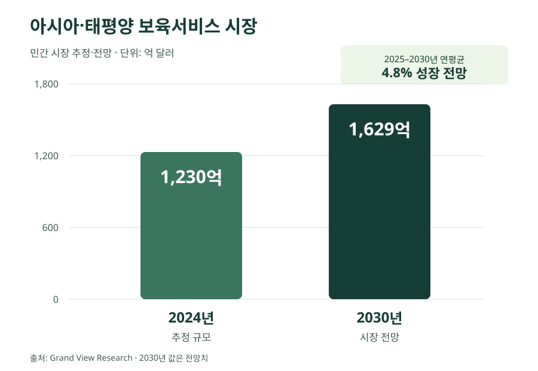

2024년 추정 **1,230억 달러**와 2030년 전망 **1,629억 달러**를 0 기준 막대그래프로 비교합니다. **2025–2030년 연평균 성장률 전망 4.8%**를 같은 그림에 표시했습니다. [Grand View Research 원자료](https://www.grandviewresearch.com/horizon/outlook/child-care-services-market/asia-pacific)

아시아·태평양 보육서비스의 민간 추정·전망이며, 유아 언어 앱 시장 규모와 구분합니다.

영어 교육의 확대와 한국어 학습의 확산이 만나는 아시아. 베트남은 미취학 아동이 한국어를 접하도록 지원하는 정책을 마련했고, 인도네시아는 2027/28학년도부터 초등 영어를 필수화합니다. 탱고북은 자국어의 첫 읽기에서 영어·한국어로 이어지는 경험으로 현지 가족을 만납니다. [베트남 정부](https://en.baochinhphu.vn/project-on-strengthening-teaching-learning-of-foreign-languages-for-20252035-approved-111251218092825922.htm) · [인도네시아 교육부](https://www.kemendikdasmen.go.id/en/press-release/13897-strengthening-global-competence-english-will-be-compulsory-in-elementary-schools-starting-in-the-20272028-academic-year)

[시장 성장·K-edu 근거 · 더 보기 ↗](branding-organic-strategy-2026-10-05.html#asia-market-detail)

### 글로벌 유료 플랫폼 비교

대표 글로벌 서비스 세 곳과 아시아 현지 자국어 서비스 한 곳을 비교했습니다. 무료 전용 플랫폼은 제외하고, 유료 구독·구매 상품의 학습 언어와 가격을 봅니다. **2026-10-05 공식 자료 기준**이며 판매 통화를 그대로 표시합니다.

| 플랫폼 · 출발 국가 | 대상 연령 | 아이에게 가르치는 언어 | 유료 가격 |
|---|---|---|---|
| **ABCmouse Classic** · 미국 | 2–8세 | 영어 중심 · 스페인어 활동 일부 · 읽기·파닉스와 수학·과학을 함께 제공 · [언어 근거](https://support.abcmouse.com/hc/en-us/articles/1500005418921-ABCmouse-Classic-Language-Options) | **US$14.99 / 월 · US$45 / 년** · 공식 웹 구독 · 별도 6개월 US$29.99 · [공식 가격](https://support.abcmouse.com/hc/en-gb/articles/360048176173-What-are-the-subscription-plans-and-how-much-do-they-cost) |
| **Lingokids Plus** · 스페인 | 2–8세 | 영어 · 스페인어 · 브라질 포르투갈어 · 놀이형 학습 · 일부 활동은 영어로 제공 · [언어 근거](https://help.lingokids.com/hc/en-us/articles/205125451-Is-Lingokids-available-in-another-language) | **US$13.49 / 월 · US$161.88 / 년** · 공식 안내의 웹 가격 예시 · [공식 가격](https://help.lingokids.com/hc/en-us/articles/115005120505-What-is-the-Price-and-currency-for-Lingokids-Plus) |
| **Reading Eggs** · 호주 | Junior 2–4세 / 본 과정 3–7세 | 영어 읽기 · 파닉스 · 영국·미국·호주 영어 선택 · 상위 과정은 13세까지 · [언어 근거](https://readingeggs.com.au/about/) | **US$9.99 / 월 · US$69.99 / 년** · 국제 사이트 · Reading 구독 · [공식 가격](https://international.readingeggs.com/pricing/) |
| **VMonkey** · 베트남 · 현지 자국어 사례 | 미취학 3–5세 / 초등까지 확장 | 베트남어 읽기 · 파닉스 · 이야기 · 아시아 자국어 학습 수요를 공략하는 현지 서비스 · [언어 근거](https://monkey.edu.vn/san-pham/vmonkey) | **VND 599,000 / 년 · VND 899,000 / 평생** · 공식 사이트 표시 할인가 · 정가 1,199,000 / 년, 1,799,000 / 평생 · [공식 가격](https://monkey.edu.vn/san-pham/vmonkey) |

2026.10.05 공식 표시 가격. 국가·스토어·할인에 따라 달라지며, VMonkey는 할인가입니다.

### 자국어에서 영어, 새로운 언어까지 이어지는 기회.

비교한 글로벌 세 서비스는 영어 또는 서구 언어 중심이고, VMonkey는 베트남어 읽기를 제공합니다. 탱고북은 아시아 아이들의 자국어·영어·한국어·중국어를 이야기와 놀이로 연결하는 방향을 잡습니다.

[비교 조건·공식 출처 · 더 보기 ↗](branding-organic-strategy-2026-10-05.html#paid-comparison-detail)

아이를 키우는 지출에서 교육은 주요 항목입니다. [국가별 양육비·교육비 자료 · 더 보기 ↗](branding-organic-strategy-2026-10-05.html#market-references)

**자국어의 첫 읽기에서, 영어·한국어까지 즐기는 이야기 도서관.**

어휘력은 낱말의 뜻을 알고 쓰는 힘, 문해력은 읽고 이해하고 표현하는 힘입니다. 다음 장부터 실제 콘텐츠와 제품으로 이 경험을 펼쳐봅니다.

## 2 책·파닉스·놀이·리포트가 함께 움직이는 플랫폼.

글자와 소리를 배우고, 이야기 속 낱말을 이해하고, 손으로 표현합니다. 파닉스·동화·놀이·리포트가 이 경험을 한곳에서 이어줍니다.

01

### 한글 · 영어 파닉스

소리와 글자를 익히고, 낱말을 직접 조합하며 읽기의 기초를 쌓습니다.

한글 · 소리와 글자 조합

**ㅂ** +**ㅏ** →**바**

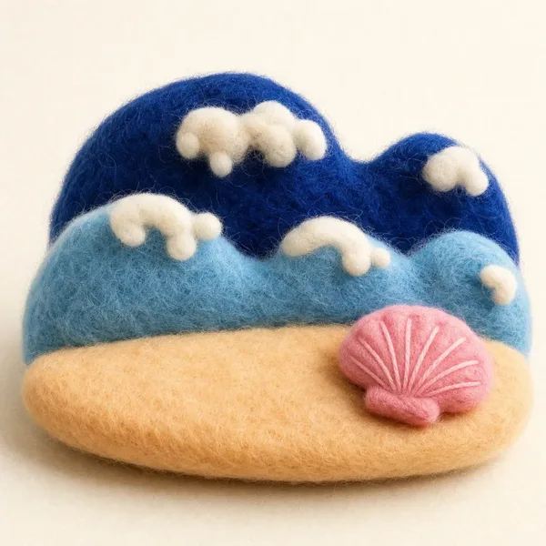

바다

영어 · 낱말 가족

**c** +**at** →**cat**

cat · 고양이

한글 4단계 · 32개 단원 / 영어 5권 · 39개 단원자세히 보기 ↗

02

### 아이의 취향만큼 넓은 동화책

+1000권의 동화책 라인업. 명작부터 창작 19시리즈까지, 아이의 취향만큼 넓은 이야기 도서관입니다. 명작 · 전래 · 자연관찰 · 생활 · 창작 시리즈에 그림과 문장, 나레이션, 어휘와 부모 가이드까지.

세계 명작

전래 동화

자연관찰

이야기 한 권에서 읽기 · 듣기 · 어휘 · 대화까지자세히 보기 ↗

03

### 직접 해보는 다양한 활동

블록 맞추기 · 낱말 쓰기 · 색칠 · 그리기 · 그림 짝 찾기. 같은 낱말을 여러 방식으로 즐깁니다.

낱말과 그림 만나기 **cat · 고양이**

→

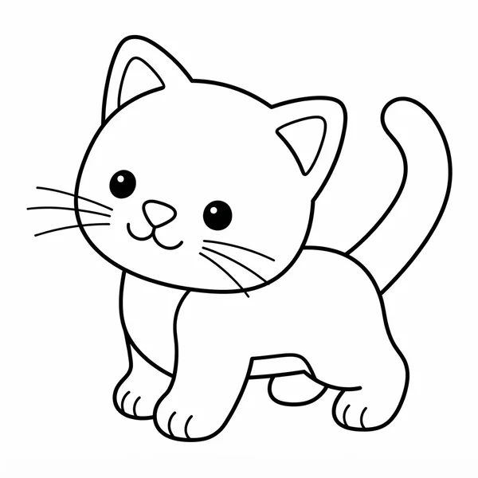

같은 낱말로 활동하기 **색칠 · 그림 짝 찾기**

한글 대표 단원 9활동 / 영어 대표 단원 6활동자세히 보기 ↗

04

### 다국어로 넓어지는 배움

같은 이야기를 여러 언어로 읽고 듣습니다. 주요 아시아 언어의 파닉스도 제작해, 자국어·영어부터 한국어·중국어까지 배울 수 있게 합니다.

**한국어** 한국

**English** 미국

**Tiếng Việt** 베트남

**中文** 중국

**ภาษาไทย** 태국

한국어 · 영어 · 베트남어 · 중국어 · 태국어자세히 보기 ↗

화면 밖으로 이어지는 경험

### 탱고 블록 · 탱고 노트 · 인쇄 활동

플랫폼에서 만난 낱말과 이야기를 손으로 만들고 쓰는 놀이로 연결합니다.

부모에게 이어지는 가치

### 아이의 경험 → 배움 기록 → 다음 놀이

무엇을 만나고 직접 연습했는지 확인하고, 아이에게 맞는 다음 경험을 지원합니다.

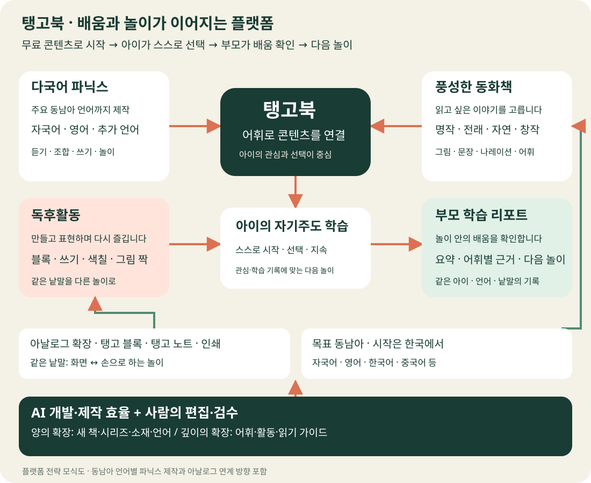

콘텐츠 → 아이의 선택과 놀이 → 학습 기록 → 다음 경험을 연결하는 플랫폼 구조

**플랫폼의 강점은 연결입니다.**  다양한 콘텐츠는 아이에게 다음 선택을 주고, 한 낱말을 여러 맥락에서 만나는 경험은 어휘와 읽기 이해의 기초를 쌓습니다. 부모는 무엇을 읽고 연습했는지 리포트로 확인합니다.

## 3 한글의 원리를 단계별로. 글자에서 낱말과 이야기까지.

모음을 시작으로 기본 자음, 받침, 쌍자음, 복잡한 모음까지 4단계로 구성합니다. 듣기·조합·쓰기·낱말 놀이를 한 단원 안에서 여러 방식으로 경험합니다. 글자와 소리의 연결은 문해력의 읽기 기초입니다. 익힌 글자를 실제 낱말과 연결하고 뜻을 함께 만나며 어휘력의 기반도 쌓습니다.

| 단계 | 학습 단원 | 읽기 범위 |
|---|---|---|
| 기본음절 | 15개 | 모음과 기본 자음 |
| 받침 | 7개 | 끝소리와 음절 |
| 쌍자음 | 5개 | ㄲ·ㄸ·ㅃ·ㅆ·ㅉ |
| 복잡한 모음 | 5개 | 모음 조합과 낱말 |

[전체 커리큘럼 · 더 보기 ↗](branding-organic-strategy-2026-10-05.html#korean-curriculum-detail)

한 챕터를 펼쳐봅니다 · 한글1 Unit 07

### ㅂ 배우기: 바다·비누·나비·두부

ㅂ의 모양과 소리를 만나고, 모음을 붙여 바·뱌·버·벼·보·뵤·부·뷰·브·비를 만들어봅니다. 그림과 음성으로 낱말의 뜻을 만나고 직접 듣고 고르고 만들어보는 놀이로 이어집니다.

실제 「한글 나무」 ㅂ 단원 1쪽 · 호리와 두부가 새 글자를 만나러 갑니다.

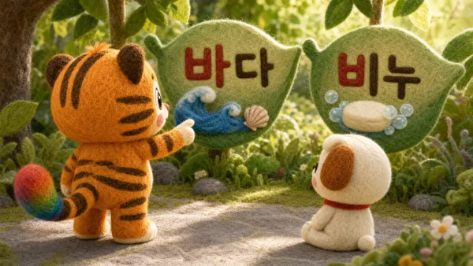

실제 ㅂ 단원 3쪽 · 바다와 비누가 이야기 속에 등장합니다.

바다

비누

나비

두부

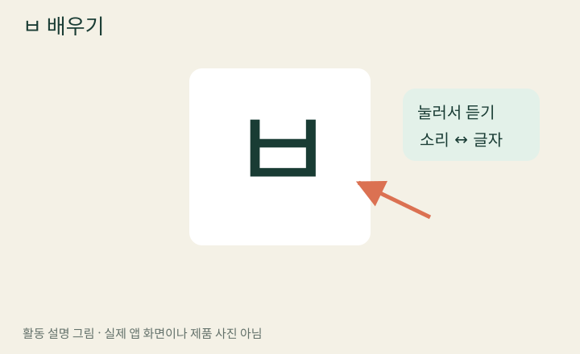

아래 그림은 실제 제공하는 활동을 설명하는 도해입니다.

### 01 ㅂ 배우기

글자를 누르고 소리와 모양을 만납니다.

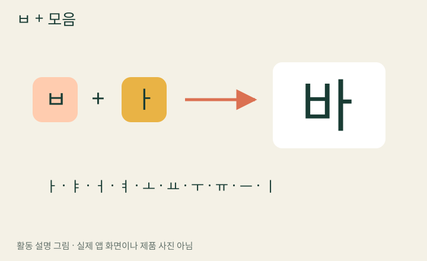

#### 02 ㅂ + 모음

자음과 모음을 조합하고 만들어진 음절을 듣습니다.

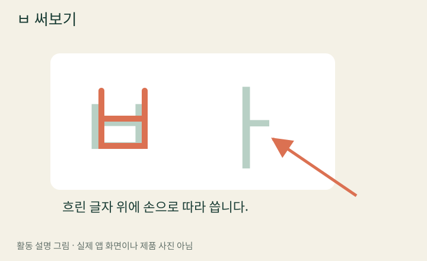

#### 03 ㅂ 써보기

획을 따라 쓰고 모음과 함께 음절을 만듭니다.

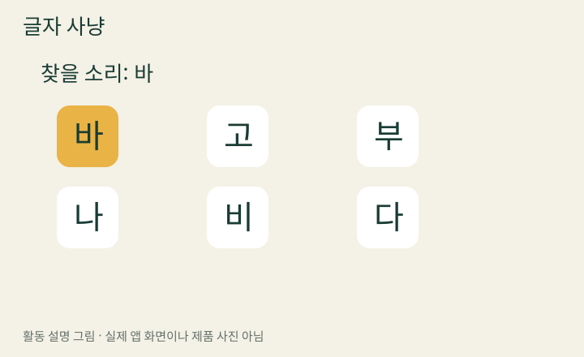

#### 04 글자 사냥

ㅂ으로 만든 음절을 듣고 여러 글자 중에서 찾습니다.

#### 05 낱말 연습

소리를 먼저 듣고 그림과 글자가 있는 낱말을 고릅니다.

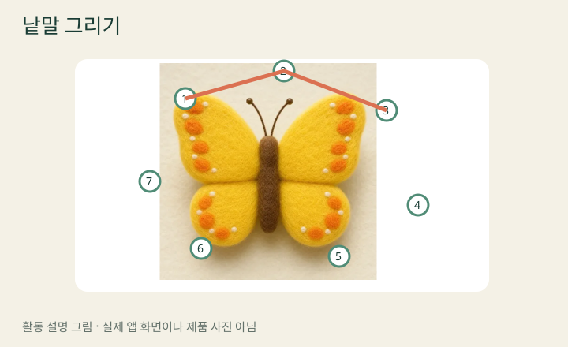

#### 06 낱말 그리기

순서대로 점을 이으며 사물의 모양을 그립니다.

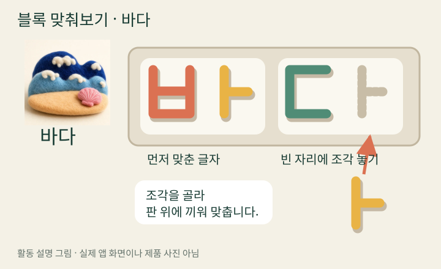

#### 07 한글 블록 게임

자모 조각을 골라 판 위의 빈 자리에 놓고 낱말을 완성합니다.

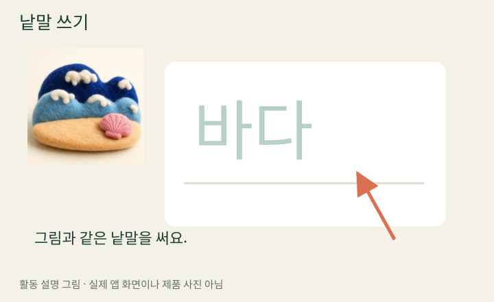

#### 08 낱말 쓰기

그림의 낱말을 따라 쓰며 글자 모양을 표현합니다.

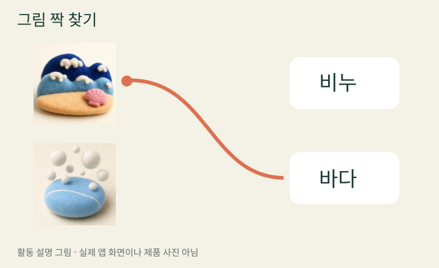

#### 09 그림 짝 찾기

그림과 알맞은 낱말을 선으로 연결합니다.

**한 단원이 여러 번 즐길 경험이 됩니다.**

전체 커리큘럼은 학습의 길을 제시하고, 한 챕터의 듣기·조합·쓰기·그림 놀이는 같은 낱말을 여러 방식으로 다루게 합니다. 체계성과 놀이의 깊이를 함께 갖춘 콘텐츠입니다.

## 4 알파벳 소리에서 철자 패턴까지. 5권으로 이어지는 영어 파닉스.

개별 음가 → 단모음 → 장모음 → 자음 조합 → 모음 조합으로 읽을 수 있는 낱말의 범위를 넓힙니다. 같은 소리와 철자 패턴을 가진 낱말 가족을 듣고, 조합하고, 쓰며 익힙니다. 소리와 철자 패턴을 읽는 연습에 그림·뜻·예문을 연결합니다. 영어 낱말을 읽고 이해하는 경험이 어휘력과 초기 문해력으로 이어집니다.

| 단계 | 학습 단원 | 읽기 범위 |
|---|---|---|
| 개별 음가 | 8개 | Aa~Zz 글자와 소리 |
| 단모음 | 8개 | CVC 낱말 가족 |
| 장모음 | 7개 | Magic e · CVCe |
| 자음 조합 | 8개 | 자음군·이중자음 |
| 모음 조합 | 8개 | 이중모음·R-통제 모음 |

[전체 커리큘럼 · 더 보기 ↗](branding-organic-strategy-2026-10-05.html#english-curriculum-detail)

한 챕터를 펼쳐봅니다 · Book 2 Unit 01

### Short Vowel a: _an과 _at 낱말 가족

짧은 a 소리를 an·at로 조합하고, 앞소리를 바꾸며 새로운 낱말을 읽어봅니다. c+an → can, f+an → fan, c+at → cat. 하나의 패턴이 여러 낱말로 확장되는 경험입니다.

can

fan

man

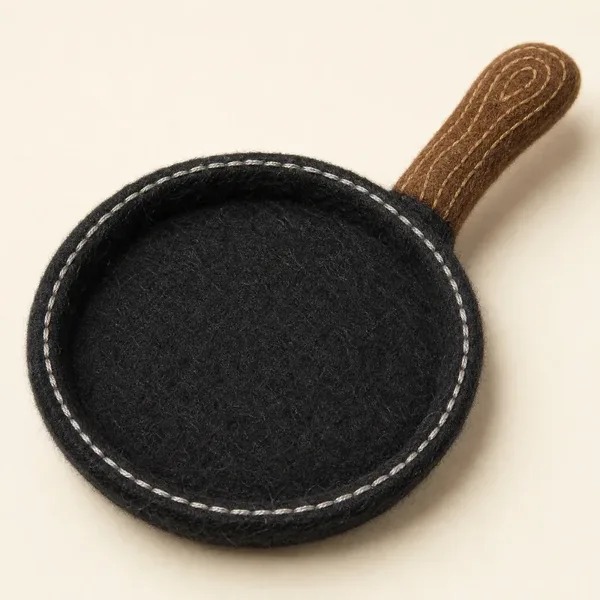

pan

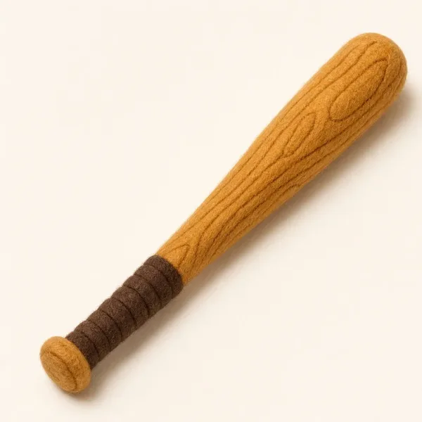

bat

cat

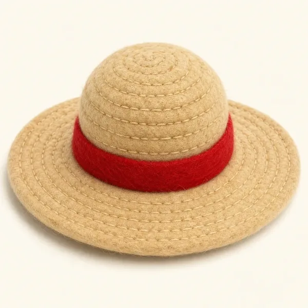

hat

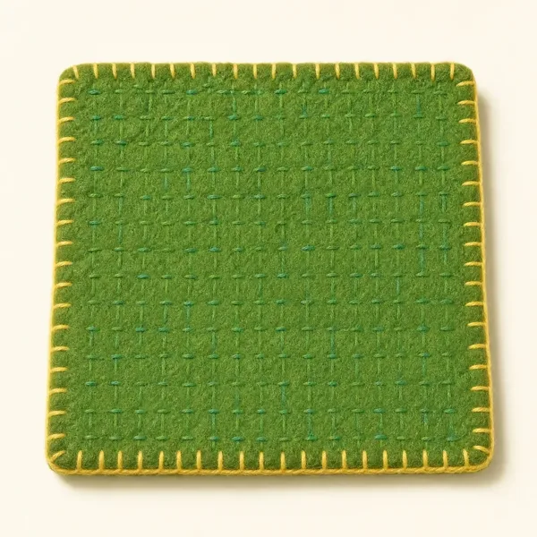

mat

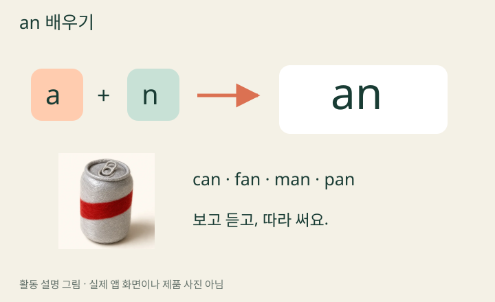

아래 그림은 실제 제공하는 활동을 설명하는 도해입니다.

### 01 an 배우기

소리 조합 → 낱말 가족 → 써보기를 한 활동 안에서 경험합니다.

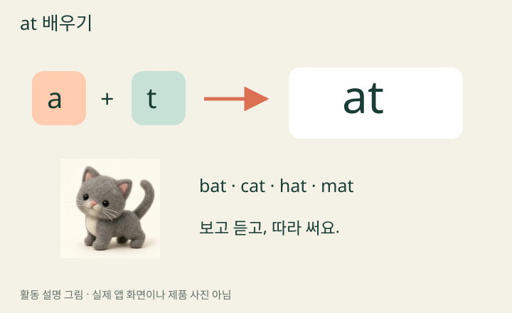

#### 02 at 배우기

소리 조합 → 낱말 가족 → 써보기를 한 활동 안에서 경험합니다.

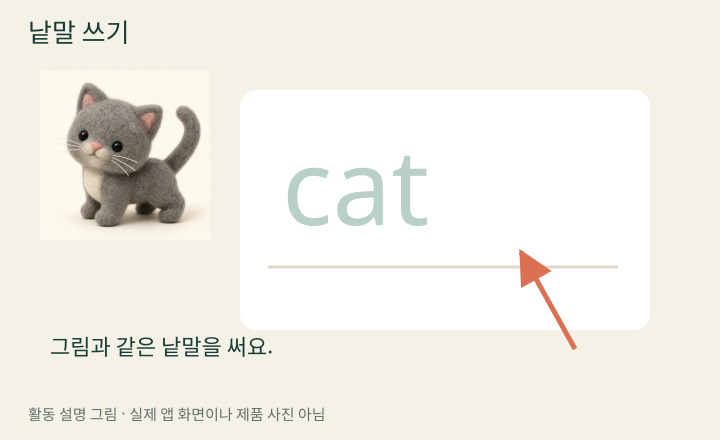

#### 03 낱말 쓰기

그림과 낱말을 연결하고 철자를 따라 씁니다.

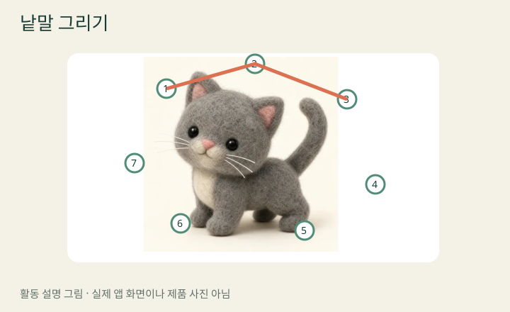

#### 04 낱말 그리기

점을 연결하며 낱말 그림의 모양을 완성합니다.

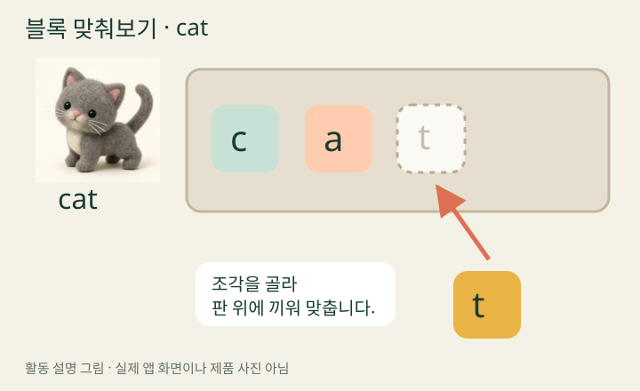

#### 05 영어 블록 게임

c·a·t 블록을 판 위에 놓고 소리와 철자를 연결합니다.

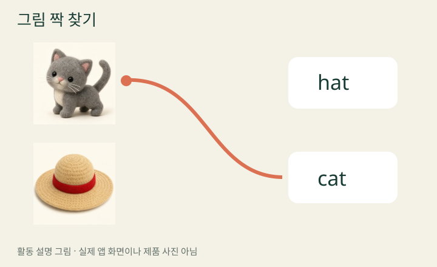

#### 06 그림 짝 찾기

그림과 뜻이 맞는 낱말을 선으로 연결합니다.

**하나의 소리 패턴이 다음 낱말로 이어집니다.**

an·at를 익히면 앞소리를 바꿔 여러 낱말을 만나게 됩니다. 소리·철자·뜻을 함께 다루는 활동이 다음 챕터의 학습으로 이어집니다.

## 5 +1000권의 동화책 라인업. 표지부터 펼쳐보고 싶은 이야기들.

세계 명작의 풍성한 장면, 전래 동화의 개성 있는 그림, 생생한 자연관찰, 친숙한 생활 이야기까지. 고르는 재미가 있는 큰 도서관입니다. 책마다 그림·문장·나레이션·어휘·부모 가이드를 담아, 좋은 그림에서 시작한 관심이 어휘력과 문해력의 경험으로 이어집니다.

탱고북 동화책 라인업

| 규모 | 무엇을 갖췄나요? |
| --- | --- |
| **+1000권** | 아이의 취향만큼 넓은 동화책 라인업 — 명작·전래·생활·자연관찰·창작까지 |
| **19시리즈** | 주인공과 무대가 이어지는 창작 이야기 — 좋아하는 캐릭터의 다음 이야기를 찾는 재미 |
| **850권** | 창작 시리즈에 담긴 풍성한 이야기 — 마을·숲·바닷가·유치원으로 넓어지는 세계 |

명작·전래·생활·자연관찰과 창작 19시리즈를 포함한 동화책 라인업입니다. 같은 작품의 다른 그림체는 별도 판본이며, 파닉스 단원은 별도로 구성합니다. [집계 기준과 분류별 수치 ↗](assets/strategy-20261005/catalogue-scale-20261005.json)

### 각기 다른 그림의 매력. 책을 고르는 순간부터 즐겁게.

장면을 가득 채우는 명작, 표정과 구도가 살아 있는 전래, 생생한 공룡과 식물. 아래는 서비스에 등록된 실제 표지입니다.

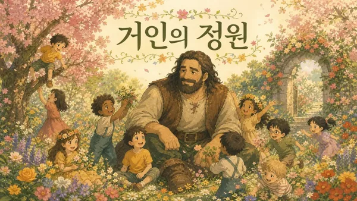

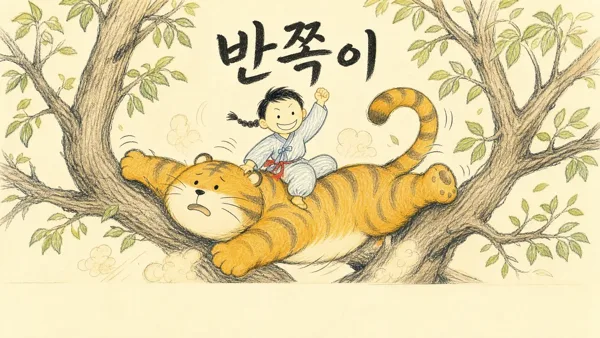

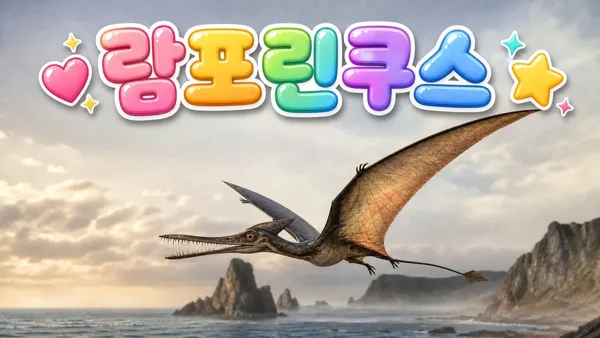

### 다양한 주제 + 이어지는 시리즈 + 알찬 한 권

좋아하는 소재로 시작하고, 익숙한 캐릭터의 다음 이야기를 찾습니다. 문장과 낱말을 보고 듣는 경험은 읽은 뒤의 놀이로 확장됩니다. 한 권은 하나의 그림체·레벨로 구성합니다.

### 세계 명작

거인의 정원부터 걸리버 여행기와 꼬마 요정까지, 오래 사랑받은 이야기의 세계.

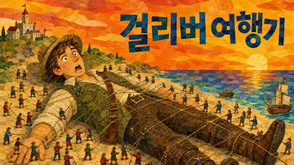

**걸리버 여행기**

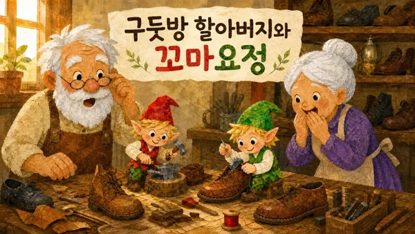

**구둣방 할아버지와 꼬마 요정**

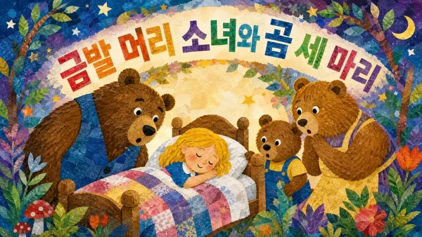

**금발 머리 소녀와 곰 세 마리**

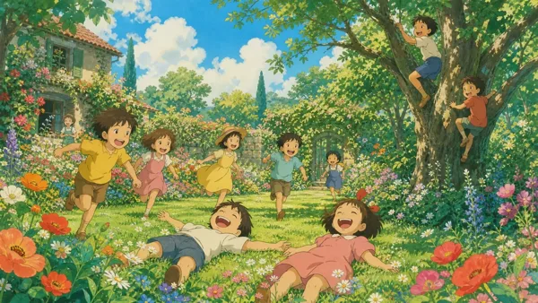

「거인의 정원」 실제 장면 · 이야기와 낱말 연결

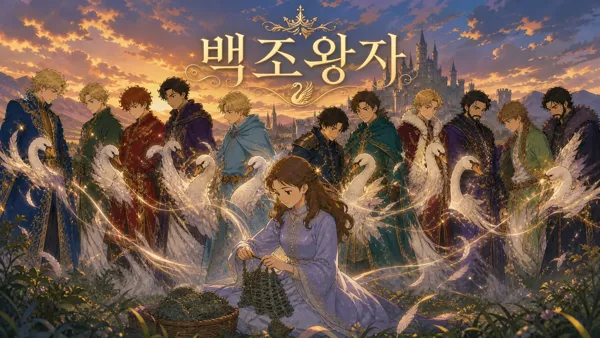

**백조 왕자**

### 전래 동화

반쪽이·두더지의 혼인·호랑이 형님처럼 우리 이야기의 상상력과 말맛.

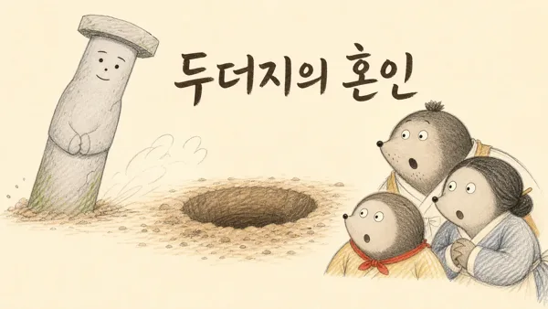

**두더지의 혼인**

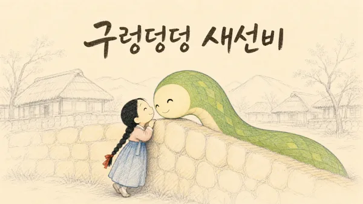

**구렁덩덩 새선비**

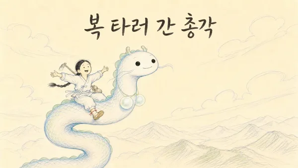

**복 타러 간 총각**

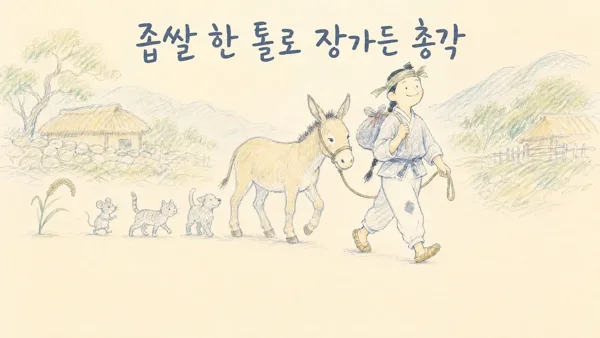

**좁쌀 한 톨로 장가든 총각**

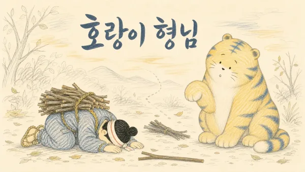

**호랑이 형님**

### 호리 유치원동화

친구·감정·안전·사과 등 아이의 일상과 맞닿은 친숙한 이야기.

**20. 내일 또 만나요**

**19. 안 돼, 위험해!**

**18. 이거 무슨 냄새?**

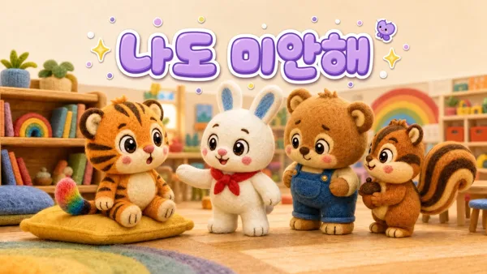

**17. 나도 미안해**

**16. 범인은 누구?**

**15. 나만 미워하는 것 같아**

### 공룡 친구들

좋아하는 공룡을 출발점으로 특징과 낱말을 알아가는 관찰 읽기.

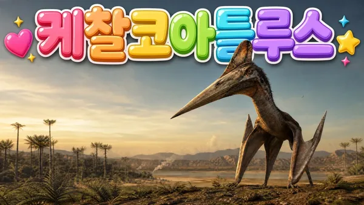

**케찰코아틀루스**

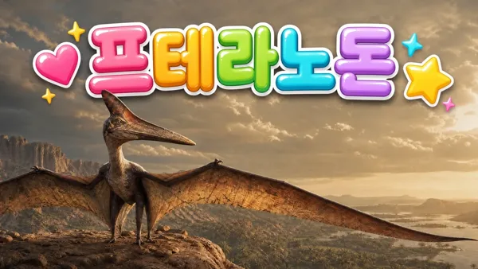

**프테라노돈**

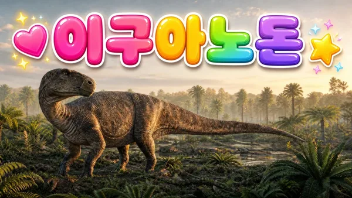

**이구아노돈**

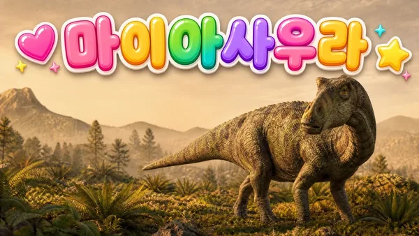

**마이아사우라**

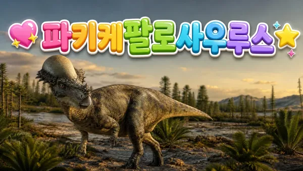

**파키케팔로사우루스**

### 육지 동물 친구들

판다·캥거루·하마 등 동물의 모습과 생활을 만나는 자연관찰.

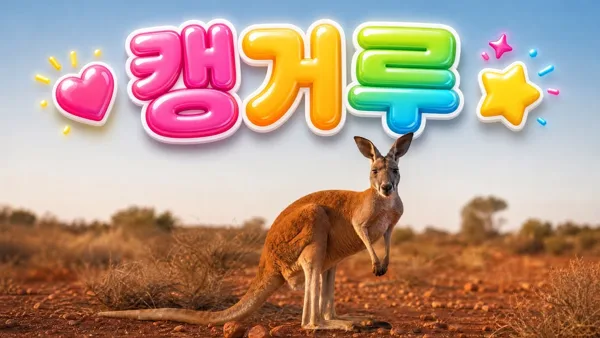

**캥거루**

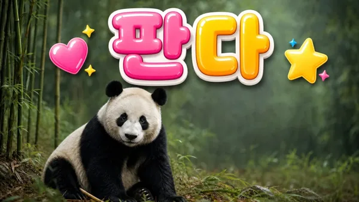

**판다**

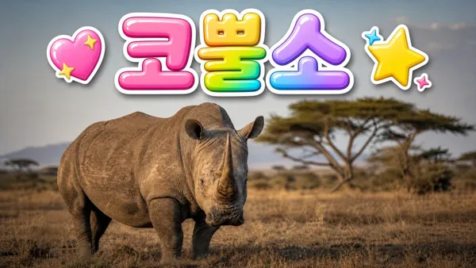

**코뿔소**

**하마**

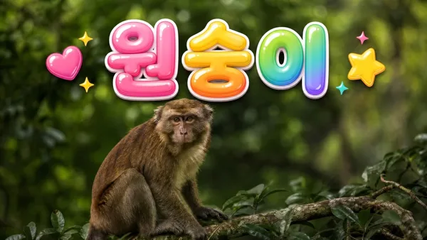

**원숭이**

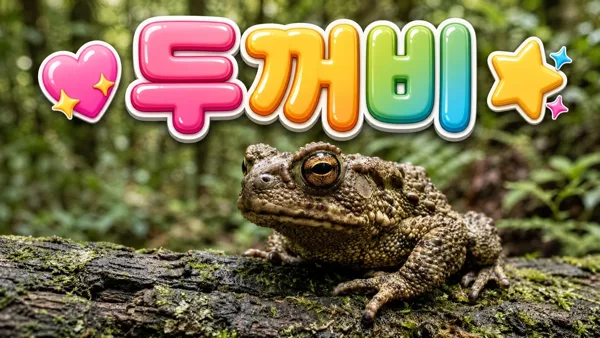

**두꺼비**

### 식물 친구들

딸기·수박·은행나무 등 가까운 자연에서 발견하는 호기심.

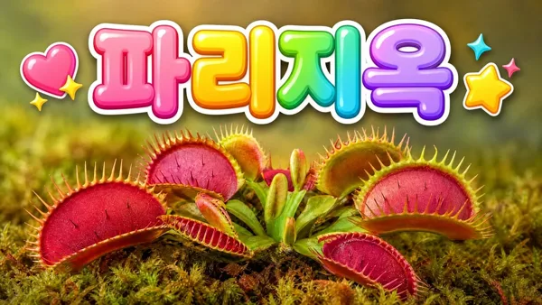

**파리지옥**

**은행나무**

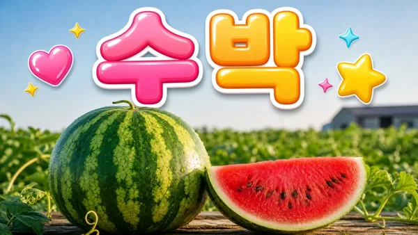

**수박**

**딸기**

**포도나무**

### 창작동화 · 캐릭터와 무대가 이어지는 시리즈

퐁이·코코·메이·피포·미나·쌍둥이. 같은 주인공과 무대에서 다음 이야기를 찾아가는 경험.

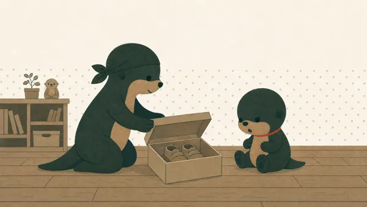

**퐁이네 운하 마을** 01. 새 신발 본문 장면 · 창작 시리즈

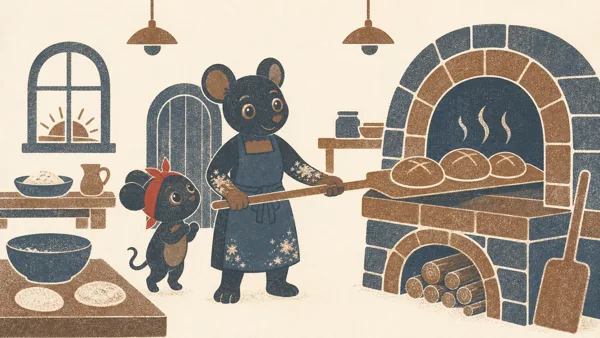

**코코네 빵집 골목** 01. 첫 배달 본문 장면 · 창작 시리즈

**메이네 산마을** 01. 나부터 탈래 본문 장면 · 창작 시리즈

**피포네 돌담 목장** 01. 첫 양몰이 본문 장면 · 창작 시리즈

**가운데 아이 미나** 01. 나도 이고 갈래 본문 장면 · 창작 시리즈

**쌍둥이네 바닷가** 01. 무너지지 않는 모래성 본문 장면 · 창작 시리즈

위에는 실제 표지 35개와 창작 시리즈 본문 장면 6개를 펼쳤습니다. +1000권의 전체 라인업 중 일부 예시입니다.

한 권을 펼쳐봅니다 · 세계 명작 「거인의 정원」

### 그림만 보는 책에서, 듣고 읽고 이야기하는 경험으로.

1쪽 · 아이들이 정원에서 노는 장면을 그림·문장·나레이션으로 만납니다.

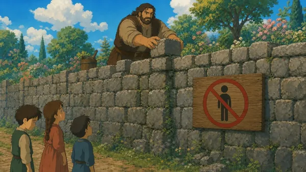

3쪽 · 거인이 담장을 쌓으며 사건이 전개됩니다.

“거인은 정원 둘레에 아주 높은 담장을 쌓았어요. 그리고 커다란 표지판을 붙였지요.”

**장면과 문장**

쪽마다 삽화와 본문을 연결합니다. 「거인의 정원」은 15쪽으로 이야기가 전개됩니다.

**듣고 읽기**

쪽별 나레이션을 듣고 문장을 만납니다. 한국어와 영어 등 언어별 본문·음성 자산을 연결합니다.

**그림 어휘**

담장·나무·표지판 등 이야기 속 낱말을 그림·소리·예문으로 다시 만납니다.

**부모 읽기 가이드**

이야기의 주제, 읽는 방법, 함께 나눌 질문을 안내합니다.

본문에서 만난 담장 · 실제 어휘 그림

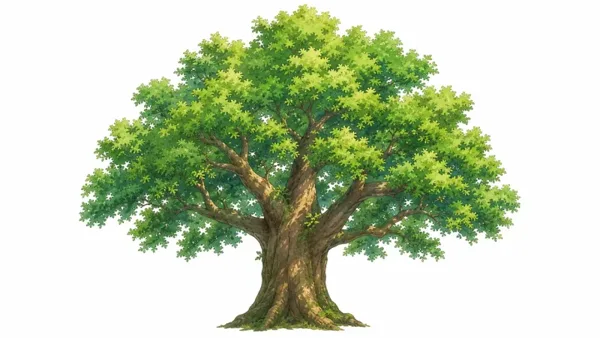

본문에서 만난 나무 · 실제 어휘 그림

**부모와 나눌 질문 예시**

“왜 거인의 정원에만 겨울이 왔을까?” 이 책의 실제 부모 가이드에 담긴 질문입니다. 원인과 결과를 함께 생각하며 읽도록 돕습니다.

읽은 뒤에는 아이가 좋아하는 낱말·장면을 고르고, 색칠·블록·쓰기 등의 독후활동으로 이어갑니다. 다음 절에서 그 놀이 구성을 살펴봅니다.

**책의 폭은 선택을, 한 권의 깊이는 머물 이유를 줍니다.**

공룡을 좋아하는 아이, 일상이 궁금한 아이, 캐릭터를 따라가는 아이가 각자 다음 책을 고를 수 있습니다. 한 권 안의 그림·문장·음성·어휘·부모 가이드는 같은 이야기를 여러 번 즐길 이유가 됩니다.

### 부모에게 무엇이 편해지나요?

**책을 고른 다음, 오늘 할 놀이와 나눌 말을 따로 찾지 않아도 됩니다.**

오늘 읽은 책에서 대화할 질문과 놀이할 낱말을 바로 찾습니다. 아이가 좋아한 장면을 다시 보거나 다른 활동을 고를 수 있어, 매번 새로운 자료를 준비할 부담을 덜어줍니다.

- 오늘 함께 할 때: 책·그림 어휘·읽기 질문이 한곳에 있어 읽기와 다음 놀이를 준비하는 부담을 덜어줍니다.
- 이용한 뒤: 리포트에서 읽은 책과 다시 볼 낱말을 확인합니다. “오늘 뭘 했어?”에서 “이 책의 이 낱말을 같이 볼까?”로 대화를 시작합니다.

## 6 이야기에서 만난 낱말을, 직접 만들고 표현합니다.

읽은 뒤의 놀이가 다음 경험을 만듭니다. 블록·쓰기·색칠·그림 짝 찾기로 낱말을 다시 다루고, 이해한 장면과 생각을 손으로 표현합니다.

이야기와 놀이의 연결

### 동화 · 파닉스 → 콘텐츠별 독후활동

블록 맞춰보기 · 써보기 · 색칠하기 **아이에게 재미를 주는 활동** 을 각 원본 콘텐츠에 연결합니다.

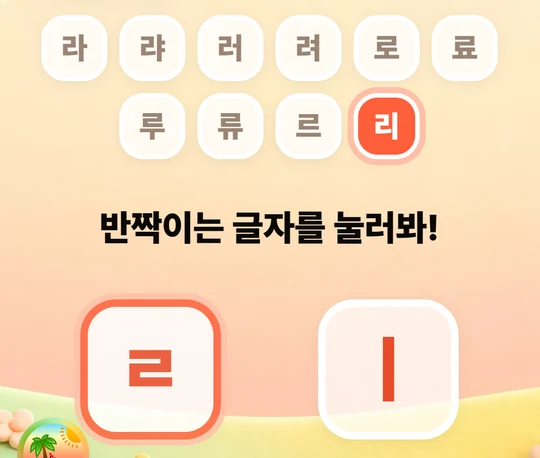

기존 낱말 활동 비주얼

LEARN / 파닉스

### 글자와 소리를 만나는 경험

아이에게는 맞히고 만드는 재미. 부모에게는 글자·소리·낱말 읽기 연습.

「거인의 정원」 실제 장면 · 이야기와 낱말 연결

ENJOY / 동화

### 다음 이야기가 궁금한 경험

아이에게는 캐릭터와 사건의 재미. 부모에게는 낱말과 문맥을 접하는 읽기 경험.

실제 제품의 체험을 새 탭에서 엽니다. 블록 게임은 ㅂ 단원의 낱말 묶음, 따라쓰기는 같은 단원 워크지, 색칠은 cat 도안입니다. 블록 단원은 계정·이용권에 따라 시작 안내가 나타날 수 있습니다.

### 대표 독후활동을 하나씩 살펴봅니다.

바다 자모 조각 → 판 위에 끼워 맞추기 · 활동 설명 도해

독후활동 01

### 블록 맞춰보기

만난 글자나 낱말을 블록으로 맞춰봅니다. **아이의 재미:**  조합하고 완성하기 **콘텐츠 연결:**  글자 모양과 자모 조합을 다시 만나기

[한글 블록 게임 직접 해보기 ↗](https://www.tangobook.co.kr/library/phonics/korean/kr-h1-u07/game-korean-block)

바다 낱말 쓰기 · 활동 설명 도해

독후활동 02

### 써보기

이야기나 파닉스에서 만난 글자를 직접 써봅니다. **아이의 재미:**  손으로 모양 만들기 **콘텐츠 연결:**  읽거나 배운 글자를 직접 표현하기

[한글 따라쓰기 직접 해보기 ↗](https://www.tangobook.co.kr/activity/hangul/kr-h1-u07)

영어 파닉스 cat · 실제 낱말 대응 색칠 도안

독후활동 03

### 색칠하기

캐릭터·장면·사물 그림을 색칠합니다. **아이의 재미:**  색을 고르고 그림 완성하기 **콘텐츠 연결:**  장면과 낱말을 다시 만나기

[cat 색칠 놀이 직접 해보기 ↗](https://www.tangobook.co.kr/activity/coloring/ph-0081-cat)

아이에게 같은 이야기의 다음 선택을 줍니다. 좋아하는 소재로 다시 해보거나 다른 활동을 고르며 낱말과 장면을 오래 즐깁니다. 디지털과 인쇄·실물 놀이의 연결은 다음 확장으로 이어집니다.

### 책에서 만난 나무, 내가 고른 색으로 다시 만납니다.

「거인의 정원」의 그림 어휘와 같은 책에 연결된 실제 나무 도안입니다. 색칠을 하거나, 정원 장면에서 나무·담장·표지판 등을 찾으며 이야기 속 낱말을 다시 만납니다.

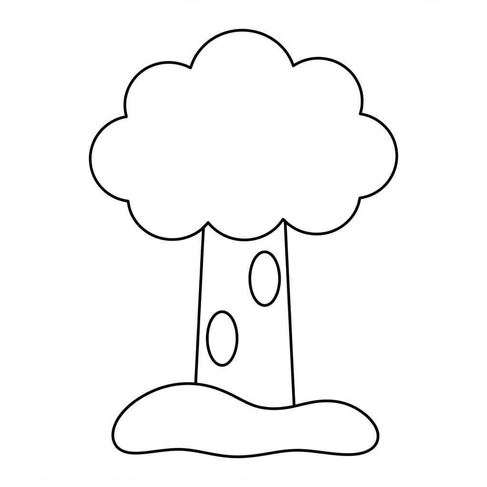

[이 책의 나무 색칠하기 ↗](https://www.tangobook.co.kr/activity/coloring/bk-0017-%EB%82%98%EB%AC%B4-%EA%B1%B0%EC%9D%B8%EC%9D%98-%EC%A0%95%EC%9B%90) · [정원 속 숨은그림 찾기 ↗](https://www.tangobook.co.kr/activity/hidden-object/ho-0007-%EA%B1%B0%EC%9D%B8%EC%9D%98-%EC%A0%95%EC%9B%90)

운영 중인 온라인 활동을 새 탭에서 엽니다. 게임 화면 캡처가 아닌 실제 어휘 그림과 색칠 도안입니다.

어휘 콘텐츠 · 낱말이 연결의 중심

### 그림으로 뜻을 만나고, 소리를 듣고, 이야기 문장에서 다시 봅니다.

책과 파닉스의 낱말을 그림·음성·예문으로 익힙니다. 어휘 상세에서는 낱말 그림과 소리를 만난 뒤 연결된 책 장면·문장으로 확장하는 구성이 있습니다. 주제별 어휘 단원도 있어 책 밖의 관심사로 낱말을 넓힐 수 있습니다.

**독후활동 확장:**  대표 활동인 블록·쓰기·색칠 외에도 그림–단어 선긋기, 이야기 듣고 그림 찾기, 장면 속 사물 찾기, 이야기 순서 맞추기, 숨은그림 찾기 등 콘텐츠에 맞는 활동을 고를 수 있습니다. 책·단원·언어마다 제공 활동은 달라집니다.

## 7 즐겁게 논 경험을, 부모가 이해할 배움의 기록으로.

리포트는 부모에게 플랫폼을 계속 이용할 이유를 설명합니다. 아이가 어떤 책과 낱말을 만났는지 보여주고, 다음 읽기와 놀이를 함께 고르는 출발점이 됩니다.

### 무엇을 읽었나요?

이번 주 읽기 흐름과 읽은 책을 확인합니다. 좋아하는 이야기를 찾아 다시 읽는 경험을 부모가 함께 볼 수 있습니다.

### 어떤 낱말을 연습했나요?

다시 볼 어휘와 파닉스의 글자·음절 상태를 살펴봅니다. 아이의 놀이 속 어휘와 읽기 경험을 구체적으로 이해합니다.

### 다음에는 무엇을 할까요?

리포트의 책과 낱말을 출발점으로 함께 읽거나 다시 놀이합니다. 기록을 다음 이용을 돕는 정보로 씁니다.

실제 제품 화면 · 테스트용 샘플 데이터

### 아이의 읽기와 낱말 경험을, 부모가 한눈에 확인합니다.

동화책 리포트는 읽은 책과 읽기 흐름, 다시 볼 낱말을 보여줍니다. 파닉스 리포트는 글자·음절별 학습 상태와 타깃 낱말을 연결해 보여줍니다.

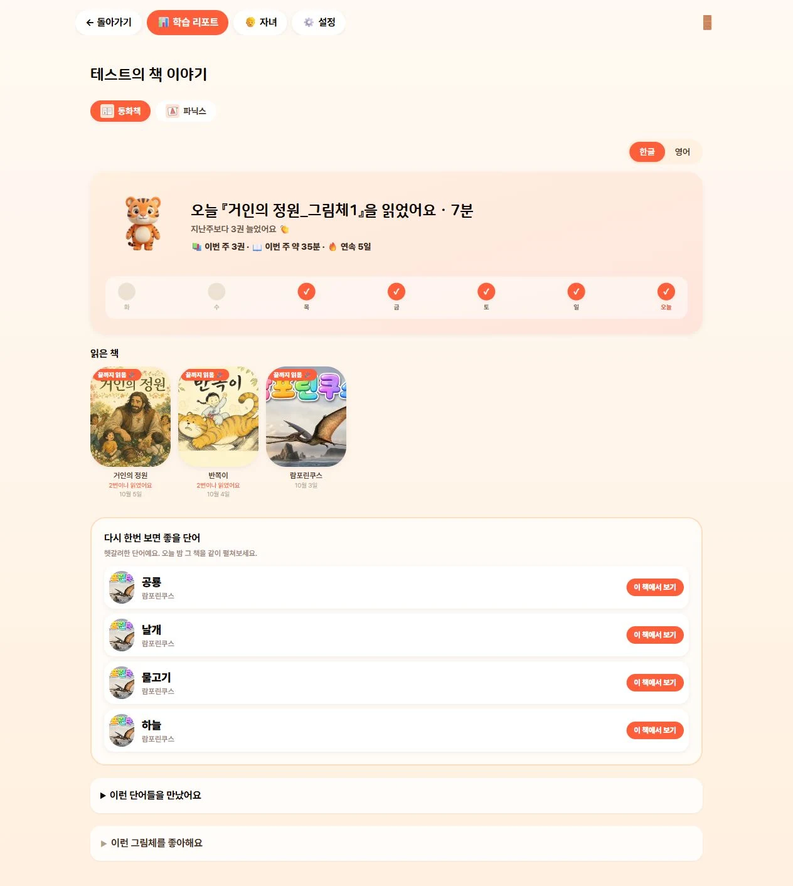

동화책 리포트 · 이번 주 읽기 요약 → 읽은 책 → 다시 볼 낱말. 테스트 계정에 넣은 샘플 기록을 실제 제품이 집계한 화면입니다.

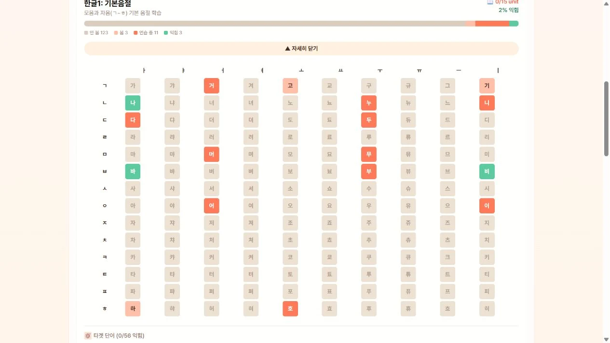

파닉스 리포트 · 자음×모음 학습표에서 만남·연습·익힘 상태를 확인합니다. 테스트용 샘플 데이터이며 실제 아이의 성과 사례가 아닙니다.

### 우리 아이가 한 경험에서, 다음 책과 연습을 찾습니다.

**맞춤형 학습 · 기록을 다음 선택으로**

공룡을 좋아하면 공룡 이야기에서 다음 책을 찾고, 낱말 연습 기록에서는 다시 해볼 놀이를 찾습니다. 부모는 무엇을 근거로 제안했는지 확인하고, 아이는 원하는 활동을 선택합니다.

관련 파닉스 추천은 구현되어 있습니다. 관심 소재와 기록을 활용한 추천 범위는 계속 넓힙니다.

부모가 확인하는 것은 콘텐츠 개수보다 **우리 아이가 한 경험** 입니다.

[학습 기록·추천의 상세 기준 · 더 보기 ↗](branding-organic-strategy-2026-10-05.html#learning-detail)

## 8 화면에서 즐긴 이야기를, 손으로 하는 놀이까지.

같은 낱말과 장면을 인쇄 자료·탱고 블록·탱고 노트로 확장합니다. 디지털 콘텐츠가 손 놀이의 소재가 되고, 손 놀이가 다시 이야기로 이어지는 구조입니다.

구현 방식에 연결할 제품 · 이름 확정

### 탱고북 · 탱고 블록 · 탱고 노트

플랫폼은 **탱고북** , 블록은 **탱고 한글 블록 · 탱고 영어 블록** , 쓰기 놀이 제품은 **탱고 노트** 로 부릅니다. 플레이노트는 과거 제품 이력과 공식 출처에서만 사용합니다.

영어 파닉스 cat · 실제 낱말 대응 색칠 도안

인쇄 활동

### 보고, 읽고, 색칠하기

책의 낱말과 도안을 함께 안내합니다. 인쇄 후에도 연결할 이야기를 찾을 수 있게 합니다.

바다 자모 조각 → 판 위에 끼워 맞추기 · 활동 설명 도해

블록 놀이 확장

### 만들고, 듣고, 읽기

이야기 속 낱말을 블록으로 만들며 손으로 글자와 소리를 다룹니다.

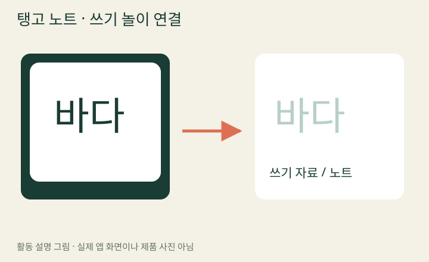

바다 낱말 → 탱고 노트·쓰기 자료 연계 도해

연계 예정 / 탱고 노트

### 읽고, 손으로 쓰기

아날로그·디지털 쓰기를 이어갈 계획입니다. 탱고북 연동은 아직 하지 않았습니다.

디지털 체험 →프린트 활동 →탱고 블록 연계 →탱고 노트 쓰기

확장 순서는 실행 제안입니다. 탱고 노트의 필기 인식·통신·자동 기록 기능은 아직 약속하지 않습니다. 실물 구매 없이도 첫 디지털 경험이 가능하도록 설계합니다. [탱고 노트 공식 제품 소개 ↗](https://teambrains.co.kr/)

[디지털·실물 혜택 검토안 · 더 보기 ↗](branding-organic-strategy-2026-10-05.html#pricing-detail)

## 9 이야기는 번역으로 넓히고, 읽기는 각 나라의 언어로 만듭니다.

같은 이야기·그림·놀이·리포트를 활용하고, 파닉스는 언어의 글자·소리·철자 규칙에 맞춰 제작합니다. 학습 언어와 아이·부모의 안내 언어를 함께 맞춥니다.

### 아시아로 넓힐 나라와 언어

인도네시아 · 인도네시아어 / 말레이시아 · 말레이어 / 태국 · 태국어 / 몽골 · 몽골어 / 베트남 등 · 현지 자국어.

주요 아시아 언어의 파닉스를 제작해 다국어 동화와 함께 제공할 계획입니다. 아래 국기는 현재 콘텐츠 언어의 예시입니다.

[베트남의 미취학 이용·교육 지출 사례 · 더 보기 ↗](branding-organic-strategy-2026-10-05.html#asia-local-detail)

**한국어**한국

**English**미국

**Tiếng Việt**베트남

**中文**중국

**ภาษาไทย**태국

### 좋아하게 된 이야기, 다른 언어로도 만나봅니다.

가족의 이용 예시 · 베트남어에서 영어·한국어로

1. **베트남어로 이야기 즐기기:** 「거인의 정원」을 자국어로 읽고 듣습니다. 아이가 좋아하는 장면과 낱말로 시작합니다.
2. **같은 이야기를 영어로:** 익숙한 그림을 보며 영어 문장과 음성을 만납니다. 영어 파닉스에서는 읽기의 기초를 연습합니다.
3. **한국어·중국어도 선택:** 같은 도서관에서 배우고 싶은 언어를 고릅니다. 아이와 부모가 익숙한 안내 언어로 이용하도록 맞춥니다.

**좋아하는 이야기를 중심으로, 배울 언어를 넓힙니다.** 언어를 바꿀 때에도 책의 그림과 이야기는 이어지고, 읽기 연습은 각 언어의 규칙에 맞춰 제공합니다.

### 이미 만든 기반을 활용하고, 가족을 만나는 방법을 맞춥니다.

함께 가져갈 기반

### 이야기 · 그림 · 놀이 · 기록

동화책은 기존 이야기와 그림을 활용하고 본문을 번역해 언어를 넓힙니다. 언어별 음성·어휘를 연결하고 공통 읽기·놀이·리포트 기능을 활용하므로, 같은 책을 여러 언어로 제공하기 쉽습니다.

현지에서 맞출 입구

### 언어별 파닉스 · 현지 학습 목적

한글·영어에서 끝내지 않고 인도네시아어·말레이어·태국어·몽골어 등 주요 아시아 언어의 파닉스 콘텐츠도 만드는 방향입니다. 언어마다 글자·소리·철자 규칙에 맞는 커리큘럼을 제작하고, 현지 안내와 부모 메시지도 함께 맞춥니다.

### 한국에서 먼저 시작하고, 아시아로 이어갑니다.

한국에서 먼저 서비스를 시작합니다. 현지 언어 파닉스와 부모 안내를 준비해 아시아로 넓히며, 국가별 첫 체험은 가족의 학습 목적에 맞춥니다.

한국 · 서비스 시작→다국어 · 같은 소재로 체험→아시아 · 다국어 학습→언어·콘텐츠·이용 확대

베트남은 아시아 시장의 한 사례입니다. 인도네시아·말레이시아·태국·몽골을 포함한 확장 방향을 잡되, 한국 이후의 첫 진출 국가와 언어별 제작 순서는 후속으로 정합니다.

## 10 아이의 손 놀이를 제품으로 만든 경험, 이제 더 넓은 콘텐츠에 씁니다.

플레이탱고와 교원 협업은 학습과 손 놀이를 상품으로 만들어 본 이력입니다. 탱고북은 이 경험을 더 넓은 콘텐츠와 활동으로 이어갑니다.

공식 자료 확인 · 2020.10.29 교원 발표

### 블록을 올리면 소리와 의미가 연결됩니다.

교원은 플레이탱고와 협력한 탱고보드를 공식 소개했습니다. 자모 블록으로 만든 글자를 음성으로 읽어주고 앱에서는 낱말의 의미를 애니메이션으로 보여주는 구조입니다.

실물 블록 →음성 반응 →앱 애니메이션

[교원 공식 출시 발표 ↗](https://www.kyowon.co.kr/Media/News_detail?iscont=&nttId=442&searchword=)

팀이 활용할 신뢰 근거

### 제품을 만들고 운영한 경험을 더 넓은 플랫폼에 씁니다.

실물 블록·소리·앱 반응을 연결한 제품 개발과 운영 경험이 있습니다. 탱고북에서는 이 경험을 이야기·낱말·다양한 활동으로 넓혀갑니다.

신뢰 메시지 제안 · “실물 블록과 디지털 반응을 연결해 온 놀이학습 개발 경험을, 파닉스·동화·활동으로 넓힙니다.”

### 우리의 출발점이 실행에 도움이 되는 이유

| 이미 가진 기반 | 팀이 바로 할 수 있는 일 |
|---|---|
| 블록·소리·앱을 제품으로 만든 경험 | 무엇을 만지고 고르게 할지, 어떤 반응을 줄지 구체적인 활동으로 설계합니다. |
| 커리큘럼·책·낱말별 활동과 리포트 | 한 가족이 직접 체험할 콘텐츠 묶음을 보여줍니다. |
| 공통 플레이어와 다국어 제작 구조 | 기존 읽기·듣기·놀이 기능에 새 콘텐츠를 추가합니다. |

어떤 책을 고르는지, 어떤 놀이를 다시 하는지, 부모가 리포트에서 무엇을 이해하는지 보고 다음 개선을 정합니다.

## 11 무료 체험으로 발견하고, 아이의 선택과 부모의 신뢰로 성장합니다.

먼저 온라인 콘텐츠로 유입을 만들고, 아이가 스스로 다시 찾는 경험을 키웁니다. 부모는 놀이 속 배움을 확인하며 다음 이용을 지원합니다.

무료 콘텐츠로 발견 →아이의 선택과 놀이 →다른 날 다시 이용 →부모의 리포트 확인 →다음 경험 지원

「거인의 정원」 실제 장면 · 대표 체험의 이야기 소재

01 부모의 발견 → 무료 체험

### 우리 아이도 해볼 수 있을까?

부모가 가진 첫 읽기·놀이 고민에 답하고, 나무 색칠·숨은그림 같은 공개 활동으로 이어줍니다. 같은 이야기의 무료 읽기 범위는 캠페인 준비 단계에서 정합니다.

이야기에서 만난 나무 · 직접 다룰 낱말 소재

02 아이의 선택 → 반복 이용

### 다시 하고 싶은 이유를 만듭니다.

좋아하는 소재, 직접 만드는 재미, 작은 성공이 다음 선택으로 이어집니다. 같은 놀이 다시 하기·다른 이야기·다른 활동 중 아이가 고르게 합니다.

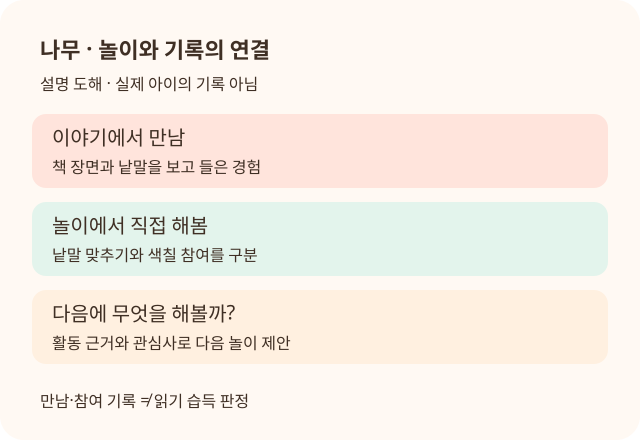

같은 나무 낱말의 경험·연습·다음 놀이 기록 도해

03 부모의 확인 → 다음 놀이 지원

### 재미 안의 배움을 이해합니다.

어떤 낱말을 만나고 무엇을 연습했는지 근거를 봅니다. 부모가 다음 놀이를 지원하고, 아이가 다시 선택하는 경험으로 이어집니다.

**콘텐츠 하나가 다음 이용의 이유가 됩니다.**  첫 체험과 같은 소재의 책·활동을 이어주고, 리포트에서 만난 낱말로 다시 읽고 놀 수 있게 합니다. 발견·이용·기록을 하나의 경험으로 연결하는 것이 오가닉 성장의 중심입니다.

### 첫 타깃과 대표 메시지 · 팀 논의 후보

| 논의 항목 | 후보와 판단 질문 |
| --- | --- |
| 첫 타깃 부모 | 미취학 자녀의 어휘·읽기에 관심이 있고, 책과 놀이를 매일 준비하기 부담스러운 부모. 국내는 한글 놀이, 해외는 현지 이야기·어휘 또는 영어 놀이 중 첫 입구를 검토합니다. |
| 대표 메시지 | “아이가 또 하고 싶은 이야기와 놀이. 부모는 배움의 과정을 확인하세요.” 플랫폼 가치 설명 후보이며 대외 슬로건 확정은 아닙니다. |

### 같은 성장 구조를, 각 나라의 입구로.

한국에서는 한글·첫 읽기 고민에 실제 놀이로 답하고, 아시아에서는 자국어·영어·추가 외국어의 학습 목적에 맞춰 안내합니다. 현지 검색·영상·부모 공유 채널은 가족의 이용을 확인하며 정합니다.

[한국 시작 단계의 채널·검색 초안 · 더 보기 ↗](branding-organic-strategy-2026-10-05.html#channels)

[대표 영상·랜딩·CTA 보기 ↗](branding-organic-strategy-2026-10-05.html#decisions)

## 12 다음 책을 더 빨리 만들고, 이미 만든 책도 더 오래 즐기게.

이미 만든 콘텐츠를 출발점으로 양과 깊이를 함께 키웁니다. 공통 기능과 제작 구조를 재사용하면서 새로운 이야기·활동·언어를 더하고, 한 권의 경험도 풍성하게 만듭니다.

플랫폼을 계속 키우는 기반

### AI로 효율을 높이고, 콘텐츠의 양과 깊이를 함께 확장합니다.

AI를 개발과 콘텐츠 제작에 활용하고, 공통 기능과 언어별 제작 구조를 재사용해 새 콘텐츠·활동을 추가하고 개선하는 부담을 낮춥니다. 사람이 기획·편집·검수하며 플랫폼 경험의 품질을 관리합니다.

#### 양의 확장

새 책과 시리즈, 관심 소재, 언어별 콘텐츠를 계속 넓혀 아이가 다음에 고를 경험을 늘립니다.

#### 깊이의 확장

기존 책에 어휘·예문·독후활동·부모 가이드를 더하고, 학습 기록과 다음 놀이 연결을 풍성하게 만듭니다.

### 같은 주인공의 이야기, 50권의 삽화로 이어졌습니다.

**실제 제작 기록 · 2026.09: 50권 · 500장**

「가운데 아이 미나」 시리즈는 로컬 AI를 활용해 삽화를 만들고, 캐릭터와 장면을 검수·수정한 뒤 운영 자산으로 등록했습니다. 01권을 포함한 50권·500장의 등록 및 원본 일치 검증이 제작 기록에 남아 있습니다.

사람이 이야기와 그림을 기획·검수하고, AI가 반복 제작을 돕습니다. 이 방식으로 긴 시리즈를 실제 콘텐츠로 채웁니다.

50권·500장은 해당 시리즈의 삽화 제작·등록 기록입니다. 비용·기간 절감률은 별도 실측이 필요합니다.

[제작·검수 기록 보기 ↗](../work/content/tasks/20260928-mina02-50-qwen-scenes.md)

### 팀이 운영할 제작·개선 방식

소재와 학습 목적 정하기 → AI로 제작·개발 보조 → 본문·음성·활동 검수 → 가족에게 체험 공개 → 막힌 부분과 다시 찾는 이유 개선.

「거인의 정원」에서는 같은 이야기와 그림을 다섯 언어의 본문·음성·어휘와 함께 제공합니다. 나무·담장 어휘도 책 안에서 만난 소재를 이어 씁니다. 새 언어를 더할 때 공통 읽기·활동 기능을 활용하고, 언어별 문장·발음·학습 맥락은 따로 검수합니다.

**이야기 하나의 제작 기반을, 다음 시리즈와 더 깊은 활동에 씁니다.** 캐릭터 참조·검수 기준·공통 기능을 활용해 새 작품을 만들고, 기존 책에는 어휘·활동·부모 가이드를 보강합니다. 검수·운영 비용을 함께 관리합니다.

[이용자 기반 이후의 수익화 검토 · 더 보기 ↗](branding-organic-strategy-2026-10-05.html#pricing-detail)

## 13 첫 체험은 한 이야기로. 영상·랜딩·리포트를 같은 경험으로 맞춥니다.

플랫폼을 설명하는 첫 체험은 책 한 장이나 게임 하나로 끝내지 않습니다. 이야기의 재미, 낱말 놀이, 다음 선택, 부모의 가치 확인을 짧게 이어 보여줍니다.

팀이 먼저 구성할 대표 체험 · 제안

### 「거인의 정원」을 보고, 나무를 만나고, 다음 놀이를 고릅니다.

이 문서에서 펼쳐본 실제 책·어휘·활동을 활용합니다. 이야기는 즐길 이유를 만들고, 놀이에서는 낱말의 뜻과 소리를 다루며, 리포트에서는 그 경험을 부모가 확인합니다.

- **01 이야기 — 정원에 무슨 일이 생겼을까?** 그림과 나레이션으로 이야기를 만납니다. [「거인의 정원」 책 열기 ↗](https://www.tangobook.co.kr/library/1772084667220)
- **02 낱말 놀이 — 이야기 속 나무로 놀아볼까?** 나무를 색칠하거나 정원 속 숨은그림을 찾습니다. [나무 색칠 직접 해보기 ↗](https://www.tangobook.co.kr/activity/coloring/bk-0017-%EB%82%98%EB%AC%B4-%EA%B1%B0%EC%9D%B8%EC%9D%98-%EC%A0%95%EC%9B%90) · [정원 속 숨은그림 찾기 ↗](https://www.tangobook.co.kr/activity/hidden-object/ho-0007-%EA%B1%B0%EC%9D%B8%EC%9D%98-%EC%A0%95%EC%9B%90)
- **03 다음 선택 — 다시 볼까, 다른 놀이를 할까?** 같은 책 다시 보기·다른 활동·다음 책을 고릅니다.
- **04 부모 확인 — 무엇을 만나고 연습했을까?** 실제 이용 기록을 보고 다음 읽기와 놀이를 돕습니다. [실제 제품 리포트 ↗](branding-organic-strategy-2026-10-05.html#journey)

같은 이야기의 책·나무 색칠·숨은그림 찾기를 바로 열어볼 수 있습니다. 이야기 읽기는 기존 계정·이용권 조건을 따르며, 온라인 색칠·숨은그림 활동은 공개 체험입니다. 캠페인의 무료 읽기 범위와 기록 연결은 공개 전에 맞춥니다.

[실제 놀이 영상·랜딩·CTA 제작안 · 더 보기 ↗](branding-organic-strategy-2026-10-05.html#first-experience-detail)

### 첫 체험에서 확인할 것은, 가족이 다음을 선택하는 이유입니다.

- **부모가 시작을 돕는가:** 실제 놀이를 보고 체험을 시작하는지, 첫 화면에서 어디에 막히는지 봅니다.
- **아이가 다음을 고르는가:** 완료 뒤 다른 활동을 고르는지, 다른 날 스스로 다시 찾는지 봅니다.
- **부모가 가치를 설명하는가:** 리포트를 보고 아이가 한 경험을 이해하는지, 다음 읽기·놀이에 활용하는지 묻습니다.

첫 제작 묶음은 실제 제품 시연 영상, 같은 나무 활동으로 연결되는 랜딩, 부모용 리포트 안내입니다. 무료 활동 시작 버튼을 먼저 제공하고, 책 읽기의 이용 조건은 별도로 안내합니다.

**설명한 놀이를 바로 해보고, 그 경험의 배움을 부모가 확인하게.**

이 묶음을 실제 가족에게 보여주고, 시작을 막는 지점과 아이가 다시 고르는 소재를 확인해 다음 제작을 정합니다.

## 14 필요할 때 펼쳐보는 실행 초안과 확인 자료.

본문의 긴 설명과 근거를 이곳에 모았습니다. ‘더 보기’ 링크로 해당 자료를 확인하고 본문으로 돌아갈 수 있습니다.

### 아시아 시장 성장·K-edu 사례와 해석 범위

OECD도 2010–2020년 자료가 있는 아시아·태평양 국가 약 4분의 3에서 유아교육 취학률이 상승했다고 보고합니다. [OECD · 2025](https://www.oecd.org/en/publications/society-at-a-glance-asia-pacific-2025_24fa8f05-en/full-report/early-childhood-education-and-care_b45e19ca.html)

시장 수치는 호주 등을 포함한 아시아·태평양 보육서비스의 민간 추정·전망입니다. 탱고북의 유아 언어 앱 시장 규모와 구분합니다.

### 동남아에서 커지는 K-edu 관심, 탱고북이 진출할 기회입니다.

**말레이시아 — 이미 현지 가족을 만나는 한국 교육 서비스.** 한국 교육기업 대교의 Eye Level은 말레이시아에서도 수준별 영어·수학 학습을 운영해 왔습니다. 한국에서 만든 교육 방식이 해외 가족을 만나는 실제 사례입니다. [Eye Level 말레이시아 · 2023년 공식 안내](https://www.myeyelevel.com/Malaysia/resources/news/view.do?boardSeq=3004)

**태국 — 관심을 넘어, 학교에서 배우는 한국어.** 2025년 태국에서는 정규 중등학교 227곳, 학생 4만 6천 명 이상이 한국어를 배우고 있습니다. 한국에 대한 관심이 실제 교육 선택으로 이어지는 현지 사례입니다. [태국한국교육원 · 2026-08 공식 자료](https://okep.moe.go.kr/board/view.do?board_manager_seq=38&board_seq=31511&menu_seq=118)

태국 수치는 중등교육의 한국어 수요이며 미취학 시장 규모와 구분합니다. 현지 사례와 앞선 시장 지표를 바탕으로 진출 기회를 판단합니다.

### 영어와 한국어, 제도적 선택 자격과 보급 규모를 함께 봅니다.

베트남에서는 한국어도 영어처럼 제1외국어로 선택할 수 있습니다. 교육과정의 선택 자격이 같다는 것과 학습자 수·학교 보급률이 같다는 것은 구분합니다. 여러 나라에서 영어는 폭넓은 학교 교육 기반을 갖추고 있고, 한국어는 정규교육의 선택지와 어린 시절의 언어 경험으로 영역을 넓히고 있습니다.

| 국가 | 영어의 교육 기반 | 한국어의 위치·확산 근거 |
| --- | --- | --- |
| 베트남 | 영어를 학교의 제2언어로 확대하는 2025–2035 국가 프로젝트. | 한국어는 2021년부터 제1외국어 선택 과정(시범). 2026년 3월 제1외국어 채택교 21곳. 미취학 한국어 친숙화 지원도 새 정책에 포함. [공식 근거 1](https://en.baochinhphu.vn/project-on-strengthening-teaching-learning-of-foreign-languages-for-20252035-approved-111251218092825922.htm) · [공식 근거 2](https://ngoainguquocgia.moet.gov.vn/ban-hanh-chuong-trinh-giao-duc-pho-thong-mon-ngoai-ngu-1-tieng-nga-nhat-phap-trung-quoc-2258705.html) · [공식 근거 3](https://www.moe.go.kr/mnstrBoardView.do?boardID=72729&boardSeq=105496&lev=0) |
| 태국 | 교육부의 기초교육 영어 강화 정책(2014): 수업·교사·디지털 콘텐츠 개선. | 2025년 정규 중등학교 227곳, 4만 6천 명 이상이 한국어 학습. 중등교육의 확산 사례. [공식 근거 1](https://www.moe.go.th/ปฏิรูปการสอนอังกฤษ-2/) · [공식 근거 2](https://okep.moe.go.kr/board/view.do?board_manager_seq=38&board_seq=31511&menu_seq=118) |
| 인도네시아 | 2027/28학년도부터 초등학교 영어 필수화 예정. | 이번 조사에서 영어와 같은 전국 초등 필수 지위를 뒷받침하는 한국어 근거는 확인하지 못함. [공식 근거 1](https://www.kemendikdasmen.go.id/en/press-release/13897-strengthening-global-competence-english-will-be-compulsory-in-elementary-schools-starting-in-the-20272028-academic-year) |
| 말레이시아 | 국립 초등학교 KSSR 교육과정에 영어 포함. | 이번 조사에서 영어와 동등한 전국 초등 필수 지위·보급 규모를 뒷받침하는 한국어 근거는 확인하지 못함. [공식 근거 1](https://www.malaysia.gov.my/en/categories/sekolah--pendidikan/sekolah-rendah/sekolah-kebangsaan) |

베트남의 미취학 한국어 친숙화는 승인된 정책 방향이며 전국 시행 완료·필수 과목을 뜻하지 않습니다. 인도네시아 영어 필수화도 2027/28학년도 예정입니다. 학교 정책과 중등 학습자 수는 진출 기회를 살펴보는 근거이며, 미취학 가정의 유료 이용 수요는 실제 체험으로 확인합니다.

**지금 동남아에 진출할 이유:** K-edu에 대한 관심을 아이가 직접 즐기는 언어 학습으로 연결할 때입니다. 현지 자국어와 영어를 기본으로, 한국어·중국어까지 이어지는 플랫폼으로 동남아 가족을 만나고 아시아로 넓힙니다.

[← 본문으로](branding-organic-strategy-2026-10-05.html#principle)

### 유료 플랫폼 비교 조건·언어 범위·공식 출처

월 구독과 연간 일괄 결제는 별도 상품입니다. 가격은 국가·스토어·프로모션·세금에 따라 달라집니다. VMonkey는 할인 표시 가격이며, 다른 상품과 동일한 결제 조건으로 환산하지 않았습니다. 유료 상품의 가격 비교이며 실제 결제율이나 시장 전체 규모를 뜻하지 않습니다.

### 아시아에서 쓸 수 있는 것과, 아시아의 언어를 배우는 것은 다릅니다.

ABCmouse는 [공식 이용 가능 국가](https://support.abcmouse.com/hc/en-ca/articles/1500008859402-Can-ABCmouse-be-used-internationally)에 아시아 국가들을 포함하고, [일본에서도 영어 학습 상품](https://www.ageoflearning.com/case_studies/ABCmE_Japan_Study_Research_Brief_06.pdf)을 선보였습니다(2022년 자료). 그러나 비교한 글로벌 세 서비스의 학습 언어는 영어 또는 서구 언어 중심입니다. 화면 메뉴가 현지어로 바뀌는 것과 자국어 읽기·파닉스 커리큘럼을 갖추는 것은 다른 일입니다.

베트남에는 VMonkey처럼 자국어를 가르치는 유료 서비스도 있습니다. VMonkey의 공식 상품 소개는 베트남어 중심이며, 한글 학습 과정은 확인되지 않았습니다. 탱고북이 겨냥하는 기회는 **아시아 아이들의 자국어와 영어, 한국어·중국어를 이야기와 놀이로 함께 배우는 경험**입니다. 인도네시아어·말레이어·태국어·몽골어 등 언어별 파닉스를 만들고, 같은 동화책을 여러 언어로 즐길 수 있게 확장합니다.

비교 범위: 대표 사례 비교이며 모든 유료 플랫폼을 조사한 전수조사는 아닙니다. 아시아 통합 다국어 경험은 탱고북의 포지셔닝 방향이며 경쟁 부재를 단정하는 결론이 아닙니다. Lingokids는 2026-09-23 갱신된 공식 학습 언어 안내를 기준으로 했습니다. 프랑스어·독일어 활동 검색 안내도 있지만 핵심 학습 언어와 구분했습니다.

국가·연령 추가 근거:

- ABCmouse: [연령·상품](https://shop.abcmouse.com/products/abcmouse-com-1-year-subscription-gift-card) · [출발 국가](https://www.ageoflearning.com/contact)
- Lingokids: [연령·상품](https://lingokids.com/promo-playlearning-games) · [출발 국가](https://lingokids.com/es/prensa/lingokids-crece-un-54-en-2021-y-llega-a-40-millones-de-familias-en-todo-el-mundo)
- Reading Eggs: [회사·연령·상품](https://readingeggs.com/about-blake/)
- VMonkey: [회사·연령·상품](https://monkey.edu.vn/san-pham/vmonkey)

[← 본문으로](branding-organic-strategy-2026-10-05.html#paid-platforms)

### 한글 4단계 · 32개 본 단원 전체

### 한글1: 기본음절 15개 본 단원

모음과 자음(ㄱ~ㅎ) 기본 음절 학습

- **모음 배우기** 모음
- **ㄱ 배우기** 자음+모음
- **ㄴ 배우기** 자음+모음
- **ㄷ 배우기** 자음+모음
- **ㄹ 배우기** 자음+모음
- **ㅁ 배우기** 자음+모음
- **ㅂ 배우기** 자음+모음
- **ㅅ 배우기** 자음+모음
- **ㅇ 배우기** 자음+모음
- **ㅈ 배우기** 자음+모음
- **ㅊ 배우기** 자음+모음
- **ㅋ 배우기** 자음+모음
- **ㅌ 배우기** 자음+모음
- **ㅍ 배우기** 자음+모음
- **ㅎ 배우기** 자음+모음

### 한글2: 받침 7개 본 단원

ㅇ, ㄱ, ㄴ, ㄹ, ㅅ, ㅁ, ㅂ 받침 학습

- **ㅇ 받침 배우기** 받침
- **ㄱ 받침 배우기** 받침
- **ㄴ 받침 배우기** 받침
- **ㄹ 받침 배우기** 받침
- **ㅅ 받침 배우기** 받침
- **ㅁ 받침 배우기** 받침
- **ㅂ 받침 배우기** 받침

### 한글3: 쌍자음 5개 본 단원

ㄲ, ㄸ, ㅃ, ㅆ, ㅉ 쌍자음 학습

- **ㄲ 배우기** 쌍자음
- **ㄸ 배우기** 쌍자음
- **ㅃ 배우기** 쌍자음
- **ㅆ 배우기** 쌍자음
- **ㅉ 배우기** 쌍자음

### 한글4: 복잡한 모음 5개 본 단원

ㅐ, ㅔ, ㅖ, ㅟ, ㅚ, ㅘ, ㅙ, ㅝ, ㅞ, ㅢ 복잡한 모음 학습

- **ㅐ, ㅔ 배우기** 복잡한 모음
- **ㅖ, ㅚ 배우기** 복잡한 모음
- **ㅟ, ㅢ 배우기** 복잡한 모음
- **ㅘ, ㅙ 배우기** 복잡한 모음
- **ㅝ, ㅞ, ㅢ 배우기** 복잡한 모음

공유 커리큘럼의 32개 본 단원 전체입니다. 복습은 별도 구성하며, 정의된 단원 수와 공개 범위는 구분합니다.

[← 본문으로](branding-organic-strategy-2026-10-05.html#korean)

### 영어 5권 · 39개 본 단원 전체

### Book 1: Single Letter Sounds 8개 본 단원

알파벳 Aa~Zz 개별 음가 (initial sounds)

- **Aa Bb Cc** initial sounds
- **Dd Ee Ff** initial sounds
- **Gg Hh Ii** initial sounds
- **Jj Kk Ll** initial sounds
- **Mm Nn Oo** initial sounds
- **Pp Qq Rr** initial sounds
- **Ss Tt Uu Vv** initial sounds
- **Ww Xx Yy Zz** initial sounds

### Book 2: Short Vowels 8개 본 단원

단모음 CVC 단어 (word families)

- **Short Vowel a (1)** _an · _at
- **Short Vowel a (2)** _ap · _ad · _am
- **Short Vowel i (1)** _ip · _it · _ix
- **Short Vowel i (2)** _ib · _id · _ig · _in
- **Short Vowel e** _et · _ed · _en
- **Short Vowel o** _og · _op · _ot · _ox
- **Short Vowel u (1)** _ug · _ub · _up
- **Short Vowel u (2)** _un · _ud · _ut

### Book 3: Long Vowels (Magic e) 7개 본 단원

Magic e 장모음 CVCe 단어

- **Long Vowel a (1)** _ake · _ape · _ave
- **Long Vowel a (2)** _ame · _ane · _ase · _ate
- **Long Vowel i (1)** _ine · _ike · _ime
- **Long Vowel i (2)** _ide · _ipe · _ite · _ive
- **Long Vowel o (1)** _ose · _ope · _ote
- **Long Vowel o (2)** _ole · _ome · _one
- **Long Vowel u** _ube · _ute · _une · _ule

### Book 4: Consonant Blends & Digraphs 8개 본 단원

자음군(bl, cr, st...) + 이중자음(ch, sh, th, ph, wh)

- **bl cl fl** bl_ · cl_ · fl_
- **br cr fr** br_ · cr_ · fr_
- **gl pl sl** gl_ · pl_ · sl_
- **dr pr tr** dr_ · pr_ · tr_
- **sm sn st sw** sm_ · sn_ · st_ · sw_
- **ng nk** _ng · _nk
- **ch sh** ch_ · _ch · sh_ · _sh
- **ph th wh** ph_ · th_ · wh_

### Book 5: Double Letter Vowels & R-Controlled 8개 본 단원

이중모음(ee, ea, ai, ay, oi, oy, ow, ou) + R-통제 모음(ar, or, ir, er, ur)

- **ee ea** ee · ea
- **oa ow** oa · ow
- **ai ay** ai · ay
- **oi oy** oi · oy
- **ow ou** ow · ou
- **ir er ur** ir · er · ur
- **ar or** ar · or
- **oo** oo

공유 커리큘럼의 39개 본 단원 전체입니다. 복습은 별도 구성하며 Book 1은 개별 음가 중심, 영어 블록 활동은 Book 2–5 구성입니다.

[← 본문으로](branding-organic-strategy-2026-10-05.html#english)

### 아시아 현지 수요 참고 · 베트남

아시아 시장의 한 사례 · 베트남

**476만 명** · 미취학 교육기관 재원 아동

2024–2025학년도 · 베트남 전국 [베트남 통계청 ↗](https://www.nso.gov.vn/du-lieu-va-so-lieu-thong-ke/2025/07/thong-cao-bao-chi-ve-tinh-hinh-kinh-te-xa-hoi-quy-ii-va-sau-thang-dau-nam-2025/)

**36.3% 증가** · 재학생 1인당 교육·훈련 지출

2024년 연 950만 동 초과 · 2022년 대비 [2024 생활수준조사 ↗](https://www.nso.gov.vn/tin-tuc-thong-ke/2025/05/thong-cao-bao-chi-ket-qua-khao-sat-muc-song-dan-cu-nam-2024/)

한 나라 안에도 수백만 명의 미취학 교육 이용자가 있습니다. 그 가족의 집에서 읽고 노는 경험을 다국어 콘텐츠로 만나는 것이 우리의 확장 기회입니다.

재원 아동 수는 유료 고객 수와 다릅니다. 지출 통계는 전 연령 재학생 기준입니다. 직접 시장 규모·지불 의사는 현지 이용으로 확인합니다. [전체 육아비·교육비 참고 자료 ↗](branding-organic-strategy-2026-10-05.html#market-references)

[← 본문으로](branding-organic-strategy-2026-10-05.html#global)

### 첫 체험 제작안 · 영상·랜딩·CTA

| 가족에게 보여줄 것 | 구체적인 구성 |
| --- | --- |
| 실제 놀이 영상 | 이야기를 보고 → 나무 낱말 활동을 고르고 → 직접 해보는 모습을 촬영합니다. 팀원의 실제 제품 시연 또는 이용 동의를 받은 촬영으로 준비합니다. |
| 랜딩 첫 화면 | 영상과 같은 나무 놀이를 보여주고 “나무 색칠 무료로 해보기”로 시작합니다. 책 읽기에는 현재 이용 조건을 안내하며, 캠페인의 무료 읽기 범위는 공개 전에 확정합니다. |
| 체험 이후 | 아이에게는 “다시 보기 / 다른 놀이 / 다음 책”, 부모에게는 “오늘의 배움 기록 보기”를 제안합니다. 이야기 이해와 낱말 연습을 구분해 설명합니다. |
| 입구별 변형 | 한글·영어 파닉스에 관심 있는 가족에게는 바다·cat 활동을 별도 입구로 검토합니다. 아시아 체험은 학습 언어와 현지 안내·부모 메시지를 맞춥니다. 첫 아시아 진출 국가는 아직 미정입니다. |

[← 본문으로](branding-organic-strategy-2026-10-05.html#decisions)

### 시장 참고 자료 · 국가별 양육비와 교육비 구성

### 시장 기회 — 글로벌 육아 지출 안에서

**자녀를 키우는 큰 지출 안에, 교육이 큰 비중을 차지합니다.**

우리가 키울 사업은 아시아 미취학 아동과 가족을 위한 다국어 학습 플랫폼입니다. 한국에서 먼저 시작하고, 아시아의 자국어·영어·추가 외국어 학습으로 넓힙니다.

시장 범위를 좁혀가는 모식도:

1. **전체 양육 지출:** 먹고·입고·돌보고·배우고·놀기. 주거·식비·의료·보육·교육·문화생활 등.
2. **그 안의 교육 지출:** 아이의 배움에 쓰는 비용. 국가별 자료에서 교육은 양육비의 주요 항목으로 나타납니다.
3. **탱고북이 겨냥하는 이용과 구매 이유:** 집에서 즐기는 어휘·읽기·놀이. 디지털 콘텐츠 → 학습 리포트 → 블록·노트·인쇄 활동.

HTML의 도형 크기는 지출 비율을 나타내지 않습니다.

#### 국가별 자료로 보는 양육 지출과 교육의 자리

| 시장 · 조사 기준 | 전체 양육 지출 | 그 안의 교육 지출 |
| --- | --- | --- |
| 미국 · 영어권 참고 · 2015년 가격, 0~17세 누적 추정 | **233,610달러 / 자녀 1명**. 중간소득 부부 가구 기준 | **보육·교육 비중 16%**. 해당 비용 지출 가구 기준, 대학 비용 제외. 2017년 발행, 현행 가격 아님. [USDA 조사 안내](https://www.fna.usda.gov/research/cnpp/expenditures-children-families) · [비용 구성 원문](https://fns-prod.azureedge.us/sites/default/files/resource-files/crc2015-march2017.pdf) |
| 태국 · 아시아 참고 · 2017년 NTA, 0~14세 누적 추정 | **약 157만 바트 / 아동 1명**. 가계와 정부 소비 지출 합계 | **교육 소비 비중 약 32%**. 공공·민간 교육 합계. 2019년 논문, 가계 부담만의 수치나 현행 가격 아님. [마히돌대 연구자 논문](https://so01.tci-thaijo.org/index.php/CMJE/article/view/175904) · [UNICEF 태국 2024 보고서 · Box 4, p.45](https://www.unicef.org/thailand/media/13291/file/Thailand%20CP%20Investment%20Analysis%20Technical%20Report%20%28FINAL%29.pdf.pdf) (2017년 추정치를 인용) |

국내 참고 자료(HTML에서는 접어서 표시): **78.5만 원 / 월** 양육비, 교육·보육 18.2만 원/월. 도서 2.2만 원과 완구 2.4만 원은 여가·문화비에 포함됩니다. 2024년 영유아 1인당 기준이며 사업 성장의 중심 근거로 사용하지 않습니다. [KICCE 표 Ⅱ-2-8](https://repo.kicce.re.kr/bitstream/2019.oak/5923/2/GR2502_2.pdf).

**베트남 · 교육 투자 수요:** 2024년 가계의 재학생 1인당 연간 교육·훈련 지출은 **950만 동 초과**, 2022년 대비 **36.3% 증가**했습니다. 학습에 지출하는 수요를 살펴볼 근거입니다. 미취학 아동에 한정한 통계나 전체 양육비 수치는 아닙니다. [베트남 통계청 2024 생활수준조사](https://www.nso.gov.vn/tin-tuc-thong-ke/2025/05/thong-cao-bao-chi-ket-qua-khao-sat-muc-song-dan-cu-nam-2024/).

**우리가 차지하려는 자리:** 부모가 따로 고르던 책과 놀이를 연결하고, 아이가 스스로 반복하며 어휘력과 문해력의 기초를 쌓는 가정 학습 경험입니다. 온라인 무료 콘텐츠로 먼저 만나고 아이의 이용과 부모의 리포트 확인에서 지속 이용의 이유를 만듭니다.

자료는 국가별 지출 구조를 보여주는 참고 근거입니다. 대상 연령·시점·정부 비용 포함 여부가 달라 합산하거나 국가 간 비용 순위를 매기지 않습니다. 전체 양육비나 교육비 전체를 탱고북의 매출 시장으로 계산하지 않습니다. 직접 진입 영역의 규모는 현지 대상 가족 수·이용률·지불 의사로 좁혀갑니다.

### 메시지 후보와 브랜드 표현

즐거움을 실제 장면으로 보여주고, 학습을 구체적인 행동으로 설명합니다. 아래 카피는 내부 검토용 후보입니다.

대표 문장 후보

이야기와 놀이로 어휘력과 문해력을 쌓는 곳, 탱고북.

파닉스로 읽기의 기초를, 동화로 어휘와 이해를, 놀이로 표현을 넓히는 미취학 아동 학습 플랫폼.

부모에게 설명할 때

### 무엇을 배우고, 어떻게 이어지는지.

“글자와 소리를 익힌 뒤, 같은 낱말이 나오는 이야기와 활동을 만나보세요.”

아이에게 제안할 때

### 무엇을 보고, 무엇을 해볼지.

“어떤 이야기를 볼까?” “바다를 색칠해볼까?”

읽기 영역의 약속은 “우리 아이 첫 글자부터 혼자 읽기까지”를 유지하는 안입니다. 활동량을 능력 향상으로 바꾸거나, 효과를 측정하지 않은 성과를 보장하지 않습니다.

### 부모 상황별 첫 체험 후보

목표는 아시아이고 시작은 한국입니다. 주요 아시아 언어의 파닉스를 제작하고, 동화책을 여러 언어로 번역해 아시아 아이들의 자국어·영어·한국어·중국어 학습을 돕습니다. 1차 타깃은 미취학 아동입니다. 부모가 첫 체험과 학습 가치 확인을 지원합니다.

아시아 목표 확정 / 한국에서 시작

한국에서 시작하고, 각 나라의 언어로 확장합니다.

“각 나라 아이의 언어와 가족의 학습 목적에 맞춥니다.” 한국에서 쌓은 이용 경험을 활용하고, 현지 언어와 가족의 반응을 확인하며 확장합니다.

한국에서 서비스 시작 →다국어 제작 구조 →아시아 현지 체험 →아시아 다국어 학습

한국에서 서비스를 시작해 쌓은 이용 경험을 아시아 서비스에 활용합니다. 목표는 처음부터 아시아이며, 국가별 언어·학습 맥락·부모의 이용 이유를 현지에 맞춥니다.

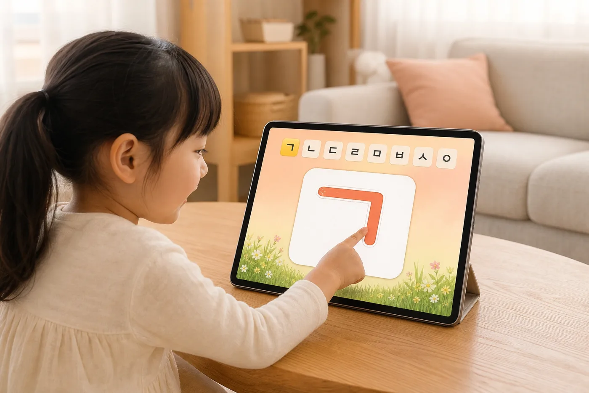

기존 랜딩 비주얼 · 이용 맥락 예시

### 한글을 시작하는 가족

**부모**  공부를 시키려면 아이가 싫어해요. **아이**  만들고 반응을 듣는 재미

첫 경험 → 파닉스와 글자 만들기

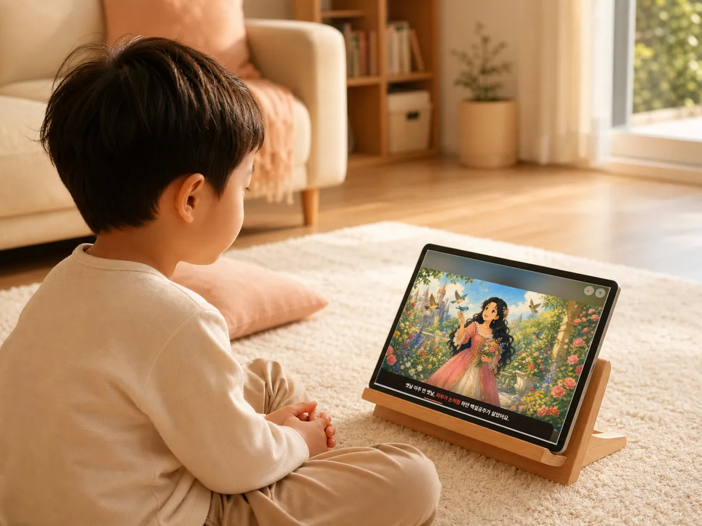

기존 랜딩 비주얼 · 이용 맥락 예시

### 책 읽기로 넘어가는 가족

**부모**  글자는 아는데 책에 흥미가 없어요. **아이**  좋아하는 소재와 캐릭터

첫 경험 → 관심사로 고른 동화

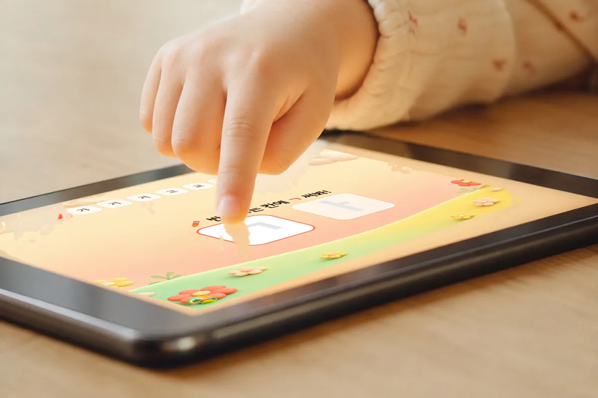

기존 랜딩 비주얼 · 이용 맥락 예시

### 손 활동을 원하는 가족

**부모**  화면 밖에서도 해볼 것이 필요해요. **아이**  색칠 · 조립 · 따라 그리기

첫 경험 → 같은 이야기의 연결 활동

파닉스와 동화는 양쪽 모두 입구가 될 수 있습니다. 이야기부터 좋아한 아이도 학습으로 이어질 수 있게 설계합니다. 해외 목표는 영어에 한정하지 않습니다. 현지 콘텐츠 언어와 학습 언어를 구분하고 아시아 우선 국가·언어·일정은 후속 결정합니다.

### 캠페인 제작 단위

한 캠페인의 원본 안내에서 자체 글·네이버 글·영상·카드를 파생합니다. 채널마다 별개의 제작 목표를 늘리지 않습니다.

바다 실제 파닉스 낱말 카드

캠페인 후보 01

### 첫 글자 놀이

**부모:**  자음과 모음을 만지고 소리로 만나기 **아이:**  만들면 반응하는 글자 **체험:**  파닉스 → 같은 낱말의 동화

거인의 정원 실제 표지

캠페인 후보 02

### 좋아하는 이야기

**부모:**  좋아하는 소재로 읽기 시작 **아이:**  캐릭터와 다음 이야기 **체험:**  공개 동화 → 낱말·활동

cat 실제 영어 파닉스 낱말 카드

캠페인 후보 03

### 읽고 표현하는 놀이

**부모:**  낱말을 손 활동으로 다시 만나기 **아이:**  색칠과 만들기 **체험:**  낱말 그림 → 쓰기·만들기 → 같은 낱말의 이야기

| 팀의 운영 단위 | 만들 것 | 발행 전에 확인할 것 |
| --- | --- | --- |
| 원본 안내 | 부모의 고민 · 실제 놀이 · 학습 요소 · 실행 방법 | 설명한 체험이 실제로 가능한가 |
| 채널별 파생 | 자체 글 1 · 네이버 글 1 · 시연 1 · 카드 1 | 연결 독후활동과 구현 방식이 명확하고 체험으로 이어지는가 |
| 가족 피드백 | 막힌 지점 · 아이의 선택 · 부모의 가치 이해 | 내부 테스트와 실제 가정을 구분했는가 |

발행량과 캠페인은 제안입니다. 미공개 작품이나 연동 예정 제품은 현재 가능한 체험처럼 소개하지 않습니다. 가상의 부모 후기를 만들지 않습니다.

### 첫 8주 실행 초안

한국 서비스의 시작일을 정한 뒤 적용할 8주 실행 제안입니다. 콘텐츠 생산량보다 체험의 연결과 반복 이용을 우선합니다.

**1—2주**

### 대표 경험 선정

문장 후보와 캠페인 3개 선정. 공개·링크·예약·측정 상태 점검.

산출물 **캠페인별 재미 · 학습 · 체험 주소**

**3—4주**

### 발행과 가족 관찰

주 1개 캠페인 기준으로 글·시연·카드 제작. 소수 가족의 사용 관찰.

산출물 **첫 체험의 막힌 지점 · 부모의 설명**

**5—6주**

### 반응 있는 연결 보완

유입 반응이 있는 주제로 후속 제작. 도안→책, 파닉스→책 경로 보완.

산출물 **유입별 체험 · 다음 경험 · 재방문**

**7—8주**

### 다음 실행 결정

유지·수정·중단 결정. 쓰기와 교구 연계의 최소 실험 범위 정의.

산출물 **다음 8주 유입 · 체류 · 재방문 우선순위**

광고 확대는 대표 경험의 안정성, 반복 이용, 부모의 학습 가치 이해, 운영 가능성을 확인한 뒤 검토합니다. 이번 문서 작성에는 광고 집행·외부 게시·예약 변경이 포함되지 않습니다.

### 한국 시작 단계의 채널 운영·검색 주제 초안

### 이 중심축을 채널 콘텐츠로 풀어냅니다.

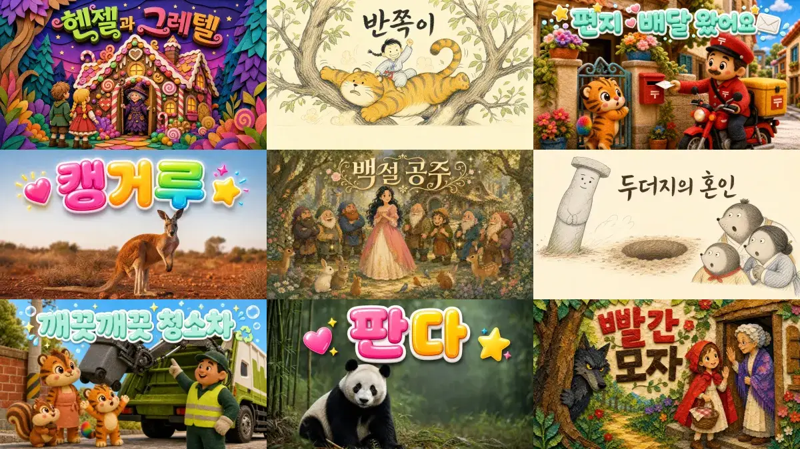

기존 책 표지 자산

검색과 블로그 / 배움의 이유

### 부모가 지금 해결하고 싶은 질문

한글 시작, 책 읽기, 독후 놀이를 구체적인 방법과 준비물로 설명합니다. 자체 사이트와 네이버 블로그를 함께 운영합니다.

「거인의 정원」 실제 장면 · 이야기와 낱말 연결

유튜브와 SNS / 해볼 이유

### 보고 나면 바로 해보고 싶은 장면

이야기 영상, 블록·색칠·쓰기 시연을 활용합니다. 유튜브와 인스타그램에서 해당 체험으로 연결합니다.

부모의 질문 →도움이 되는 콘텐츠 →직접 체험 →다음 활동 →재방문

검색어 후보: 한글 시작 방법 / 글자는 아는데 책을 안 읽는 아이 / 동화 독후활동 / 공룡 색칠 도안 / 한글 블록 놀이. 현재 검색량을 확인한 우선순위는 아니며 발행 전 검색 의도를 검토합니다.

| 채널 운영 제안 | 역할 | 다음 행동 |
| --- | --- | --- |
| 자체 사이트 · 검색 | 체험과 자료가 쌓이는 본진 · 우선 운영 | 같은 소재의 책·파닉스·활동 열기 |
| 네이버 블로그 | 부모의 구체적인 고민에 답하기 · 우선 운영 | 글에서 소개한 체험으로 이동 |
| 유튜브 | 이야기의 재미와 실제 이용 장면 전달 | 영상과 연결된 다음 경험 안내 |
| 인스타그램 | 짧은 시연과 저장할 활동 제안 | 해당 활동 안내 페이지 |
| 부모 커뮤니티 | 운영자를 공개하고 자료·질문·피드백 수집 | 동의한 가족의 체험과 의견 |

채널 우선순위는 운영 제안입니다. 성과 수치를 확인한 순위가 아닙니다. 기존 예약과 자동 발행 상태를 점검한 뒤 적용합니다.

### 가격·혜택 검토안

가격 전략 제안 · 미확정

### 기본 디지털은 무료. 아날로그 구매에는 디지털 혜택을.

무료 기본 콘텐츠 →온라인 유입 · 체류 →아날로그 구매는 후속 →연계 유료 디지털 제공

| 구분 | 역할 |
| --- | --- |
| 무료 기본 콘텐츠 | 무료만으로도 충분히 배우고 즐기는 온라인 경험 |
| 유료 디지털 콘텐츠·기능 | 추가 가치와 아날로그 구매 혜택을 명확하게 구분 |
| 탱고 블록 · 탱고 노트 등 | 주요 수익원 가설. 구매 시 관련 디지털 혜택 제공 |

AI를 활용한 개발·제작 비용 절감이 무료 경험을 넓히는 기반이라는 내부 가설입니다. 개발비와 검수·호스팅·AI 호출·지원·제조·배송 비용은 분리합니다. 제작 효율은 실제 비용과 검수 시간을 측정해 확인합니다.

‘기본 콘텐츠 무료’를 알리고 유료 범위도 함께 안내합니다. 가격·해제 범위·기간·구매 인증은 후속 결정이며 첫 체험에 교구 구매를 요구하지 않습니다.

### 기록·집계·활동 안내의 고도화 메모

### 같은 낱말에서 다음 경험을 찾습니다.

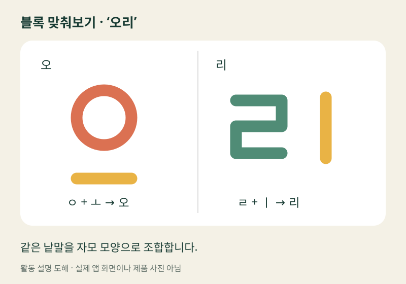

오리 → 자모 조합 · 활동 설명 도해

활동 완료 후 관련 파닉스

### 오리 놀이를 마친 뒤, 오·리가 궁금해집니다.

책을 읽는 흐름을 끊지 않고, 독후활동을 마친 뒤 실제 연습한 낱말의 관련 파닉스를 제안합니다. 아이는 다음 놀이를 고르거나 관련 단원을 해볼 수 있습니다.

화면 문구 예시 · 실제 아이 기록 아님

### 오리

**탱고북에서 처음 만나는 낱말이에요.**  한글 파닉스 ㄹ 단원에서도 만날 수 있어요. **이 낱말의 파닉스는 아직 학습하지 않았어요.**

오·리 소리 놀이 해보기 다음 놀이 고르기

파닉스 기록이 조회되어 해당 학습이 없다고 확인된 경우의 예시입니다. 관련 파닉스 완료·나가기 후에는 독후활동 목록으로 돌아옵니다.

활동 완료 후 관련 파닉스 제안과 독후활동 목록 복귀는 구현되었습니다. 진행 중 게임의 같은 라운드로 돌아가는 기능은 추가 과제입니다. 본문의 리포트는 실제 제품을 캡처했으며 수치는 테스트용 샘플 데이터입니다.

맞춤형 학습 · 아이의 관심과 기록을 다음 경험으로

### 같은 플랫폼 안에서도, 아이마다 다음에 고를 경험은 달라집니다.

좋아하는 소재, 학습 언어, 어떤 낱말을 만나고 직접 연습했는지에 따라 다음 책·놀이·복습을 제안합니다. 아이는 추천을 보고 원하는 경험을 선택하고 부모는 추천의 이유를 확인합니다.

#### 관심에 맞는 이야기

동물·공룡·캐릭터 등 아이가 좋아하는 소재에서 다음 책을 찾습니다.

#### 기록에 맞는 연습

만난 낱말과 직접 해본 활동, 관련 파닉스 이력을 구분해 다시 해볼 놀이를 찾습니다.

#### 선택할 다음 경험

새 이야기·다른 활동·복습을 제안하고, 이유를 알려주며 아이의 선택을 남깁니다.

연습 기록에 따른 관련 파닉스 추천과 활동 완료 후 목록 복귀는 구현되어 있습니다. 관심 소재별 선택을 넓히고, 추천 범위와 이용 흐름을 계속 개선합니다.

아래는 초기 기획에서 남긴 상세 검토 메모입니다. 현재 구현 진행과 검증 결과는 [학습 리포트 구현 기록](../work/reading/tasks/20261005-learning-report-implementation.md)에서 관리합니다.

| 기록으로 확인한 상태 | 알려줄 내용 | 다음 경험 |
| --- | --- | --- |
| 노출·활동 기록 없음 + 파닉스 타깃 | 탱고북에서 처음 만나는 낱말 · 관련 파닉스 학습 기록 없음 | 소리·뜻을 먼저 만나고, 관련 파닉스 선택 |
| 동화·활동에서 만남 + 파닉스 기록 없음 | 전에 만난 낱말 · 파닉스에서는 아직 배우지 않음 | 글자·소리가 궁금하면 관련 파닉스 선택 |
| 노출만 있음 + 직접 연습 없음 | 만나 본 낱말 · 아직 연습 기록 없음 | 맞추기·쓰기 등의 짧은 연습 선택 |
| 여러 활동에서 연습함 | 노출·활동 기록과 현재 학습 상태 | 새 이야기에서 다시 만나기 · 필요한 부분 복습 |
| 비회원·기록 조회 중·조회 실패 | 학습 기록을 확인할 수 없음 | 미학습으로 단정하지 않고 활동을 계속 제공 |

기록의 단위 · 설계 제안

### 아이 × 언어 × 어휘를 중심으로 기록합니다.

같은 아이가 여러 책·파닉스 단원에서 만난 같은 의미의 낱말은 연결합니다. 한글 ‘바다’와 영어 ‘sea’는 연관 어휘로 묶되 학습 기록은 언어별로 구분합니다. 동음이의어는 의미를 구분하고, 단어별 상태와 관련 음절·패턴의 상태도 따로 봅니다.

중복 이벤트를 정리하고 활동 출처·종류·책/단원·시점·결과를 보존합니다. 누락된 기록은 학습 안 함으로 판정하지 않습니다. 학습도는 기록을 바탕으로 한 서비스의 추정 상태이며, 노출 횟수나 활동 한 번만으로 익혔다고 확정하지 않습니다.

**기존 기반:**  아이 프로필별 word_exposed·word_correct·word_wrong 이벤트와 출처·언어·단원 정보, 어휘/파닉스 타깃 단어 집계, ‘안 봄·봄·연습 중·익힘’ 표시가 있습니다. **현재 구현:** 활동 완료 후 실제 연습한 낱말의 관련 파닉스를 제안하고, 선택한 활동을 마치면 독후활동 목록으로 복귀합니다. 모든 활동의 기록 수집이 완비됐다는 의미는 아닙니다. 기존 노출 수·정답률 기반 점수를 그대로 ‘파닉스 완료’로 사용하지 않습니다.

아이에게는 다음 놀이 제안을 짧게, 부모에게는 노출·활동 근거와 학습 상태를 자세히 보여줍니다. 같은 낱말마다 반복 팝업을 띄우기보다 활동 카드나 결과 화면에서 자연스럽게 안내합니다. 현재 집계·추천 동작은 구현 기록을 기준으로 확인하며, 능력 진단·자동 난이도 조절과 구분합니다.

| 분석할 구분 | 부모에게 의미 있는 설명 | 기록·검증 과제 |
| --- | --- | --- |
| 노출과 실제 연습 | 이야기에서 만나 본 낱말인지 직접 다뤄 본 낱말인지 | 화면·듣기·읽기·직접 활동 이벤트 분리, 중복 정리 |
| 뜻과 소리·글자 | 그림의 뜻을 고르는 것과 소리·글자를 연결하는 것은 다른 경험 | 활동별로 확인 가능한 능력 지정 |
| 첫 시도와 재시도 | 바로 해냈는지 반복해서 맞췄는지 | 시도 순서·힌트·도움·중단 수집 여부 확인 |
| 한 번 성공과 다시 성공 | 같은 날의 반복인지 다른 날·다른 맥락에서도 해냈는지 | 날짜·세션·콘텐츠별 이력, 조건이 비슷한 비교 |
| 어휘와 파닉스 이력 | 낱말은 만났지만 연결 파닉스는 아직 학습하지 않았는지 | 어휘–단원 매핑과 출처별 조회; 전체 점수를 단원 완료로 쓰지 않음 |
| 기록 없음과 미학습 | 처음 만난 기록인지 데이터를 확인할 수 없는 상황인지 | 게스트·누락·언어 미지정·오프라인·조회 실패 구분 |

**초기 기획 당시의 점검 메모:**  어휘 집계의 exposed에는 정답·오답 시도도 포함되므로 그대로 ‘보기·듣기 횟수’라고 부르면 의미가 섞입니다. 기존 학습도는 정답률·시도 수·시간 경과를 반영하는 추정치입니다. 상태 배지는 0.6부터 ‘익힘’, 타깃 단어 익힘 수 집계는 0.85 기준이므로 설명을 통일해야 합니다. 일부 게임은 단어 결과 수집에 후속 과제가 있으며, 모든 기록의 출처·언어 판별도 점검합니다. 이 수치와 과제는 초기 점검 이력이며 현재 구현의 미완료 목록이 아닙니다. 최신 집계·추천·검증 결과는 학습 리포트 구현 기록을 따릅니다.

### 확인 근거와 자료 출처

**근거와 문서 관리**

콘텐츠 구성은 shared 커리큘럼, phonics-learner 단원 구성, 게임 SceneReveal 코드와 책 모델을 2026.10.05 확인했습니다. 한글 32·영어 39는 본 단원의 정의 수이며 공개 콘텐츠 수가 아닙니다. 활동 완료 후 관련 파닉스 제안과 독후활동 목록 복귀는 구현되었습니다. 진행 중 게임의 같은 라운드 복귀는 후속 과제입니다.

[NICHD · 읽기 발달과 파닉스·어휘·이해 ↗](https://www.nichd.nih.gov/health/topics/factsheets/reading)

확정 방향은 2026.10.05 사용자 결정입니다. 1차 타깃은 미취학 아동으로 확정했습니다. 슬로건·채널 우선순위·발행량·8주 일정은 제안이며, 가격과 기술 연계 범위, 아시아 우선 국가·언어·진출 일정은 미결입니다. 아시아 목표·한국에서 시작·주요 아시아 언어 파닉스 제작·자국어와 영어 및 한국어·중국어 등의 다국어 학습 방향은 확정입니다. 과거 성공 평가는 창업자의 직접 사업 경험으로 기록했습니다.

[교원 공식 발표 · 2020.10.29 ↗](https://www.kyowon.co.kr/Media/News_detail?iscont=&nttId=442&searchword=)[플레이탱고 · 플레이노트 공식 소개 ↗](https://teambrains.co.kr/)

이미지: 실제 동화·파닉스 낱말·활동 자료, 활동 설명 도해, 테스트용 샘플 데이터를 넣은 실제 제품 리포트 캡처. 이용 맥락 사진은 고객 후기나 성과 사례가 아닙니다. HTML 안에 이미지가 포함돼 인터넷 없이 볼 수 있습니다. 공식 출처 링크 열기에는 인터넷이 필요합니다.
